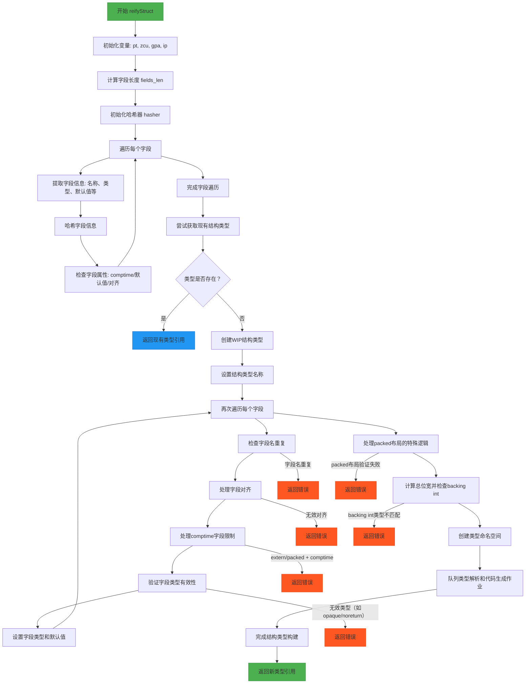

好的，我现在需要根据用户提供的Zig代码，使用Mermaid语法绘制该函数的流程图。首先，我需要仔细阅读并理解这段代码的功能和结构。这个函数名为`reifyStruct`，看起来是用于处理结构体的具体化过程，可能涉及类型检查、字段验证、内存布局等操作。

首先，我会通读整个函数，了解其主要步骤。函数开始于一些变量声明，比如获取指针、长度等。然后进入一个循环，遍历每个结构体字段，进行各种检查和哈希计算。接着，处理结构体类型，检查是否存在重复的类型，并处理不同类型的布局（如extern、packed）。之后，处理字段的默认值、对齐、是否是编译时字段等。最后，处理命名空间和代码生成相关的内容。

接下来，我需要将这个过程分解成流程图中的各个节点和判断分支。流程图通常包括开始、结束、处理步骤、条件判断等元素。需要确定每个主要步骤和可能的错误路径。

首先，流程图的开始节点是函数入口。然后，步骤可能包括：

1. 初始化变量（如获取pt、zcu、gpa等）。
2. 计算字段长度。
3. 初始化哈希器，开始遍历每个字段。
4. 对每个字段进行各种验证（名称、类型、默认值、对齐等）。
5. 处理结构体类型的重复性检查，若存在则返回现有类型。
6. 创建新的结构体类型（WIP类型）。
7. 设置结构体名称。
8. 再次遍历字段，进行更详细的验证（对齐是否符合要求，是否是comptime字段，默认值是否存在等）。
9. 处理packed布局的特殊情况（位宽总和，检查backing int类型）。
10. 创建命名空间，队列作业（解析类型、生成代码）。
11. 完成结构体类型，返回结果。

在过程中，需要注意错误处理，比如`errdefer`部分，以及各种条件判断，例如字段是否重复、对齐是否合法、类型是否有效等。每个条件判断都需要在流程图中体现为分支。

另外，循环处理每个字段的部分，需要表示循环结构。在Mermaid中，可以用循环标记来表示。

可能的挑战是确保所有条件分支都被正确识别，并且流程的顺序正确。特别是处理两次遍历字段的部分，第一次用于哈希和初步验证，第二次用于详细设置结构体字段属性，需要明确区分这两个阶段。

需要确认每个错误返回点，如字段名重复、无效对齐、类型不允许等，这些都需要在流程图中作为条件分支，指向错误处理或直接返回错误。

最后，将所有这些步骤和判断用Mermaid的语法组织起来，确保逻辑清晰，结构正确。
================================================
