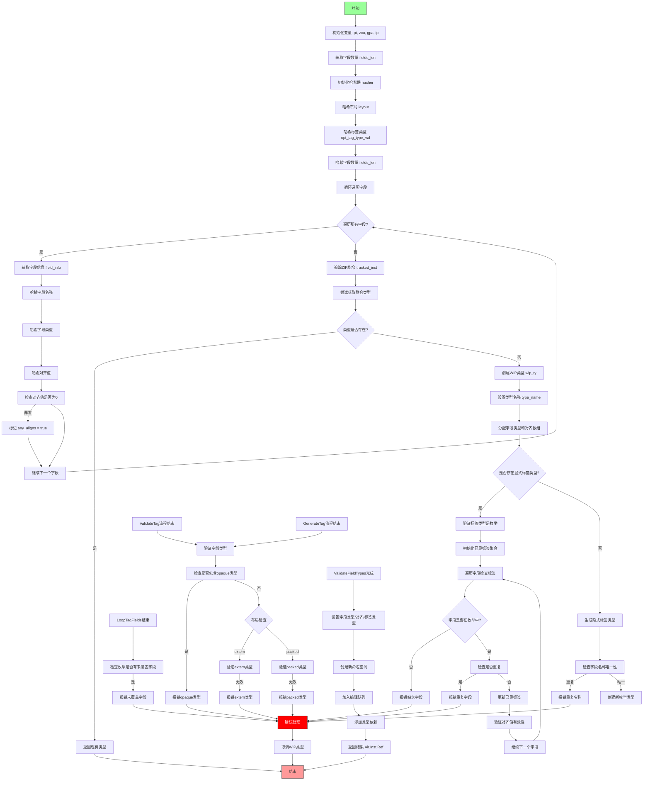

好的，我需要为给定的 Zig 函数 `reifyUnion` 绘制一个 Mermaid 流程图。首先，我需要理解这个函数的结构和逻辑流程。让我先仔细阅读代码，并尝试分解它的各个步骤。

函数 `reifyUnion` 的主要任务似乎是处理联合类型（union）的具体化（reify）。具体来说，它可能涉及到验证字段、处理标签类型、生成哈希以确保唯一性、处理不同类型的布局（如 extern、packed），以及最终构造并返回一个联合类型。

首先，函数开始部分初始化了一些变量，如 `pt`, `zcu`, `gpa`, `ip`，这些可能是与编译器和类型系统相关的上下文或工具。接下来，获取字段的长度 `fields_len`，然后使用哈希器 `hasher` 来生成一个哈希，用于后续的类型去重。哈希的内容包括布局、标签类型值、字段数量，以及每个字段的名称、类型和对齐方式。

接下来，函数检查是否存在非零对齐的字段，如果有，则设置 `any_aligns` 为真。然后通过 `block.trackZir(inst)` 追踪 ZIR 指令，并尝试获取或创建一个新的联合类型（`wip_ty`）。如果类型已经存在，直接返回；否则，继续处理。

之后，设置类型的名称，并根据是否存在显式的标签类型（`opt_tag_type_val`）来处理不同的情况。如果有显式标签类型，需要验证每个字段是否存在于该枚举类型中，并检查是否有重复或缺失的字段。如果没有显式标签类型，则生成一个新的枚举类型作为标签，并确保字段名称唯一。

在处理字段类型时，会检查字段类型是否符合布局要求（如 extern 或 packed），如果不符合则报错。最后，设置联合类型的字段类型、对齐方式、标签类型，并更新其状态。同时，创建新的命名空间，并将类型加入编译队列。

在整个过程中，错误处理（`errdefer`）确保在发生错误时取消未完成的类型创建，并清理资源。

现在，我需要将这些步骤转化为流程图。流程图应该包括主要决策点、循环、错误处理以及函数的主要流程。可能的节点包括：

1. 初始化变量和哈希。
2. 遍历字段，收集信息并更新哈希。
3. 检查是否存在显式标签类型。
4. 处理显式标签类型的情况：
   a. 验证每个字段是否存在于枚举中。
   b. 检查重复或缺失的字段。
5. 处理隐式标签类型的情况：
   a. 生成新的枚举类型。
6. 验证字段类型是否符合布局。
7. 设置联合类型的字段和标签。
8. 处理错误，清理资源。
9. 返回结果。

需要注意的是循环结构（如遍历字段），以及条件判断（是否有显式标签类型，布局类型等）。此外，错误处理部分可能需要单独的分支，导致提前返回。

在绘制流程图时，使用 Mermaid 的语法，用不同的形状表示开始/结束、过程、决策、循环等。例如：

- 矩形表示过程步骤。
- 菱形表示决策点。
- 六边形表示循环。
- 圆角矩形表示开始和结束。

还需要注意流程的顺序和分支的正确连接，确保逻辑正确。此外，错误处理的 `errdefer` 可能需要额外的步骤，但通常在流程图中可能简化为错误出口。

可能需要将某些复杂步骤分解为子流程，例如处理显式和隐式标签类型的情况，可以分别作为两个分支。同时，字段遍历部分需要循环处理每个字段。

总结起来，流程图的大致结构可能是：

开始 → 初始化变量和哈希 → 遍历字段 → 处理标签类型（显式/隐式） → 验证字段类型 → 设置联合类型属性 → 处理命名空间和编译队列 → 返回结果。错误处理贯穿整个过程，可能导致提前退出。

现在，我需要将这些步骤用 Mermaid 语法具体化，确保每个步骤和分支正确连接。
================================================
