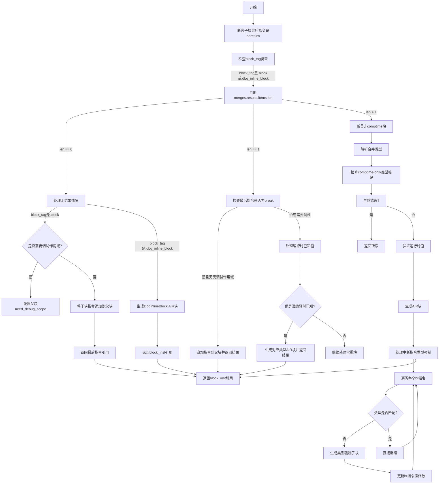

好的，我需要为给定的Zig函数`resolveAnalyzedBlock`绘制一个流程图。首先，我需要理解这个函数的主要逻辑和各个条件分支。让我先通读一下代码，看看它主要做什么。

这个函数似乎处理块（block）的解析和合并。它检查块是否需要生成调试作用域，处理不同的块类型（如普通块和调试内联块），处理块中的中断（break）指令，并进行类型强制转换等操作。函数内部有很多条件判断，比如根据`merges.results.items.len`的不同值执行不同的操作，还有各种错误检查和处理。

接下来，我需要确定函数的主要流程步骤。首先，函数开始时会进行一些断言，确保子块的最后一条指令是noreturn类型。然后根据块类型（block_tag）进入不同的处理分支。如果`merges.results.items.len`为0或1，会有不同的处理逻辑，例如直接将指令追加到父块，或者生成AIR块。对于结果数大于1的情况，会进行类型解析和错误检查，并处理中断指令的类型强制转换。

在绘制流程图时，应该从函数入口开始，按照各个条件分支逐步展开。需要注意的条件包括：
1. `merges.results.items.len`的值（0、1、>1）
2. `block_tag`的类型（.block、.dbg_inline_block）
3. 是否需要调试作用域（need_debug_scope）
4. 结果值是否为编译时已知（comptime-known）
5. 类型是否匹配，是否需要强制转换

同时，错误处理和断言也是流程中的重要部分，比如检查块是否为comptime，类型是否为comptime-only等。

现在，我需要将这些逻辑步骤转化为Mermaid流程图。每个条件判断对应一个菱形节点，不同的处理分支用箭头连接，并标注条件。可能的结构如下：

1. 开始
2. 断言检查子块最后指令是noreturn
3. 检查block_tag类型，如果不是.block或.dbg_inline_block则不可达
4. 处理merges.results.len == 0的情况：
   - 如果是.block类型且不需要调试作用域，直接将子块指令追加到父块
   - 如果是.dbg_inline_block，生成对应的AIR块
5. 处理merges.results.len == 1的情况：
   - 检查最后一条指令是否是break到当前块，如果是则追加指令到父块
   - 否则生成AIR块，处理编译时已知值的情况
6. 处理merges.results.len >1的情况：
   - 解析类型，检查comptime-only类型错误
   - 验证运行时值，生成AIR块，处理中断指令的类型强制
7. 结束，返回相应的引用

在流程图中，每个条件分支都需要明确标注，例如“merges.results.len == 0？”，“block_tag是.block？”，等等。处理不同的情况后，流程汇聚到共同的结束点或继续处理其他分支。

需要注意的是，某些步骤可能包含循环，例如最后的处理中断指令的类型强制转换部分有一个循环遍历`merges.br_list.items`。这应该在流程图中用循环结构表示，或者在流程中简化为一个处理步骤，并在子流程中展开。

此外，错误处理路径（如返回错误消息）也需要在流程图中体现，可能需要使用不同的箭头或节点来表示错误退出。

最后，确保流程图的逻辑与代码一致，没有遗漏重要的步骤或条件。
================================================

这个流程图涵盖了函数的主要逻辑分支，包括：
1. 处理无合并结果的情况（len=0）
2. 处理单个合并结果的情况（len=1）
3. 处理多个合并结果的情况（len>1）
4. 类型强制转换循环处理
5. 错误检查路径

关键决策点用菱形表示，主要操作步骤用矩形表示，最终汇聚到返回block_inst引用的共同出口。循环处理br指令的部分用循环箭头表示，实际绘制时可能需要根据mermaid语法调整循环表示方式。