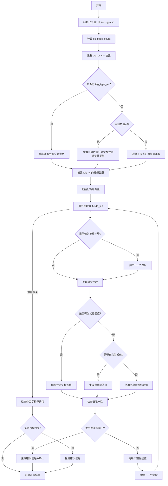

嗯，我现在需要帮用户用Mermaid画出这个Zig函数的流程图。首先，我得仔细看看这个函数的代码，理解它的结构和逻辑流程。

函数名是resolveDeclaredEnumInner，看起来是处理枚举类型声明的内部函数。参数很多，有sema、block、wip_ty、inst等等。可能涉及到类型解析、错误检查、字段处理等步骤。

首先，函数开始部分，获取pt、zcu、gpa、ip这些变量。然后计算bit_bags_count，这可能和位操作有关。接着处理tag_ty_src，可能是标签类型的源码位置。

然后进入int_tag_ty的定义，这里有条件判断：如果body不为空，就调用analyzeInlineBody；如果有tag_type_ref不为none，就解析类型并检查是否为整数类型；否则根据字段数量决定位数，创建整数类型。这部分可能有分支，需要判断不同的情况。

接下来设置wip_ty的标签类型。然后处理字段循环，遍历每个字段，处理每个字段的tag值。这里有多个条件分支，比如是否有tag_value，是否any_values等。处理每个字段时，可能有错误检查，比如tag值是否重复，是否溢出等。

循环结束后，检查是否为非穷尽枚举，并验证是否所有值都已指定。如果有问题，返回错误。

现在需要把这些步骤转化为流程图。流程图通常包括开始、结束、判断分支、处理步骤、循环等元素。

开始节点：函数入口。
处理初始变量和bit_bags_count。
处理tag_ty_src。
判断tag_type_ref是否为none？如果是，检查body是否非空，然后解析类型是否为int，否则创建int类型。
设置wip_ty的tag类型。
进入循环处理每个字段。
对于每个字段，处理是否有tag值，处理可能的溢出，检查唯一性，记录错误等。
循环结束后检查non-exhaustive的情况，返回错误或成功结束。

需要注意循环内的条件分支，比如是否有tag_value，any_values的不同处理路径，以及错误处理的情况。每个判断点都需要分支，比如是否溢出，是否冲突等。

可能有些步骤需要细化，比如处理字段名称、解析tag值、添加字段到wip_ty等。此外，错误处理部分可能需要生成错误消息并返回。

最后，确保流程图的正确性和完整性，涵盖所有主要分支和循环结构。
================================================
