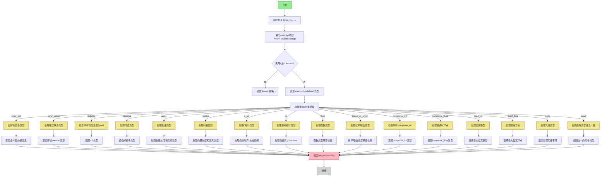

好的，我需要为给定的Zig函数`resolvePeerTypesInner`绘制一个流程图。首先，我需要理解这个函数的结构和逻辑流程。

函数开始于初始化一些变量，如`pt`、`zcu`、`ip`，然后进入一个循环，遍历`peer_tys`以确定合并策略`PeerResolveStrategy`。接着处理不同策略的分支，比如`.error_set`、`.error_union`、`.nullable`等。每个分支都有特定的逻辑来处理类型解析，可能涉及递归调用自身或其他辅助函数。

为了绘制流程图，我需要识别主要的步骤和条件分支。首先，函数初始化变量，然后遍历`peer_tys`来确定策略。之后，根据策略进入不同的处理分支，每个分支可能包含循环、条件判断和递归调用。最后，返回解析结果。

需要注意每个`switch`语句对应的不同情况，尤其是处理不同类型（如数组、指针、函数等）的逻辑。同时，递归调用`resolvePeerTypesInner`需要在流程图中体现出来，可能作为子流程处理。

由于代码较长且复杂，流程图需要分层次展示。主流程包括初始化、策略选择、根据策略处理不同类型，最后返回结果。每个策略分支可以作为一个子流程，详细展示其内部逻辑。

可能遇到的挑战是处理递归调用和复杂的条件判断，需要确保每个分支的逻辑清晰，并且在流程图中正确表示。此外，代码中的错误处理和返回结果也需要在流程图中体现。

总结步骤：
1. 初始化变量。
2. 遍历`peer_tys`确定合并策略。
3. 根据策略处理不同类型。
4. 处理每个策略的具体逻辑，可能递归调用。
5. 返回解析结果或错误。

接下来，根据这些步骤绘制Mermaid流程图，确保每个主要步骤和分支都清晰可见。
================================================
