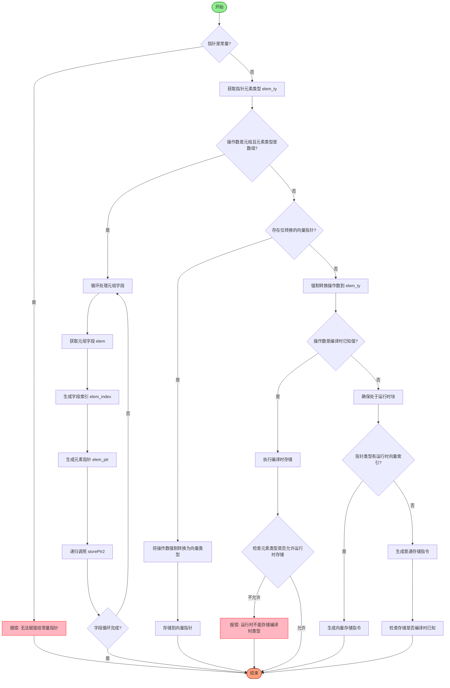

嗯，我需要为这个Zig函数`storePtr2`画一个流程图。首先，我得仔细阅读代码，理解每个步骤的逻辑。这个函数的主要功能是处理指针存储，包括检查常量指针、处理元组和数组的情况，处理向量指针的位转换，以及处理运行时存储等。

首先，函数开始时会检查指针类型是否为常量，如果是常量则报错。然后获取指针指向的元素类型。接下来处理元组类型的情况，如果操作数的类型是元组且元素类型是数组，则对每个字段进行处理，递归调用`storePtr2`。

之后，尝试处理位转换后的向量指针，如果存在这样的指针，则将操作数转换为向量类型并进行存储。然后，进行类型强制转换，检查操作数是否可以在编译时确定，如果可以，则进行编译时存储；否则，检查指针是否为运行时，处理可能的运行时错误。

接着，处理向量索引的情况，如果指针类型是向量索引，则生成相应的向量存储指令。最后，根据是否为返回指针，生成不同的存储指令，并检查编译时已知的存储。

在画流程图时，需要将这些步骤分解成不同的判断和操作节点。比如，首先检查指针是否为常量，如果是则报错；然后处理元组、处理向量指针位转换，接着类型转换，检查编译时值，处理运行时存储，向量索引处理，最后生成存储指令。

需要注意的是，递归调用`storePtr2`处理元组字段时，需要循环处理每个字段，这部分在流程图中应该表现为一个循环结构。另外，错误处理和不同路径的判断也需要明确标出。

可能遇到的问题包括正确识别各个条件分支，以及如何处理递归和循环结构。需要确保每个判断节点都有明确的是/否分支，并且每个操作步骤都清晰可见。此外，函数中有些TODO注释，可能需要标注出来，但根据当前代码内容，不需要特别处理这些TODO，除非流程图需要体现未完成的部分。

总结一下，流程图的大致结构应该是：开始 → 检查常量指针 → 处理元组 → 处理向量指针 → 类型转换 → 检查编译时存储 → 处理运行时存储 → 处理向量索引 → 生成存储指令 → 结束。其中每个步骤可能包含子流程，尤其是处理元组时的循环和递归调用。
================================================
