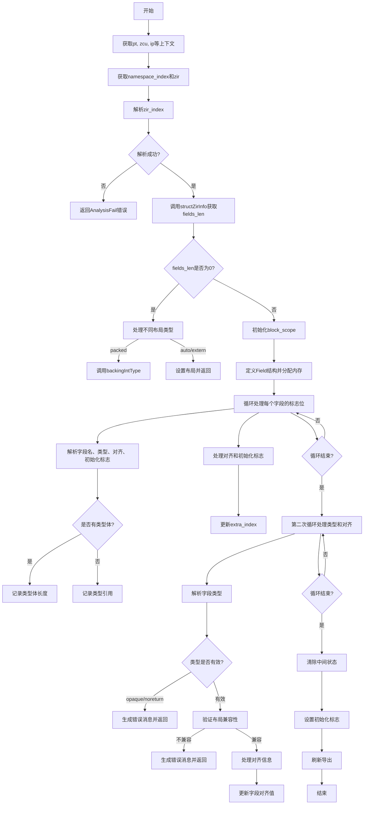

嗯，我需要为给定的Zig函数`structFields`绘制一个Mermaid流程图。首先，我得仔细阅读代码，理解它的逻辑流程。

函数开始于获取一些上下文变量，比如`pt`、`zcu`、`gpa`、`ip`等。然后从`struct_type`中获取`namespace_index`和`zir`。接着处理`zir_index`，如果解析失败则返回错误。

接下来调用`structZirInfo`获取`fields_len`等信息。如果`fields_len`为0，根据不同的布局类型进行处理，比如调用`backingIntType`或设置布局解析后返回。

如果`fields_len`不为0，初始化一个`block_scope`，并在之后释放确保其指令列表为空。然后定义一个内部结构`Field`，并为字段分配内存。接着处理每个字段的标志位，包括是否有对齐、初始化、是否编译时等，并填充`fields`数组。

之后分两次处理：第一次处理类型和对齐，第二次处理初始化。在处理类型时，解析字段类型，检查是否为不透明类型或noreturn，并根据结构布局验证类型。如果有对齐信息，处理对齐。最后，清除字段类型的中间状态，如果没有初始化则设置标志，并刷新导出。

现在我需要将这些步骤转化为流程图。流程图应该包括开始、条件判断（如fields_len是否为0）、循环处理每个字段、错误处理、以及不同布局类型的处理分支。

可能需要注意的节点包括：
1. 开始
2. 获取structZirInfo并检查fields_len
3. 处理fields_len为0的情况（不同布局）
4. 初始化block_scope
5. 分配fields数组
6. 循环处理每个字段的标志位和属性
7. 处理类型和对齐
8. 检查类型有效性（如opaque、noreturn）
9. 处理布局验证（extern、packed）
10. 处理对齐信息
11. 清除中间状态和设置标志
12. 结束

需要注意条件分支，比如fields_len是否为0，不同布局类型，是否有类型体、对齐体、初始化体等。循环处理每个字段时可能有多个条件判断。

可能的结构：
- 开始
- 获取信息并检查fields_len
  - 如果fields_len ==0，进入布局处理分支
  - 否则，初始化block_scope，分配fields数组
  - 循环处理每个字段的标志位
    - 处理字段名、类型、对齐、初始化
  - 再次循环处理类型和对齐
    - 解析类型，检查有效性
    - 处理对齐
  - 清除状态，设置标志，结束

需要确保每个判断和循环在流程图中正确表示，使用Mermaid的节点、条件判断（菱形）、循环结构等。
================================================
