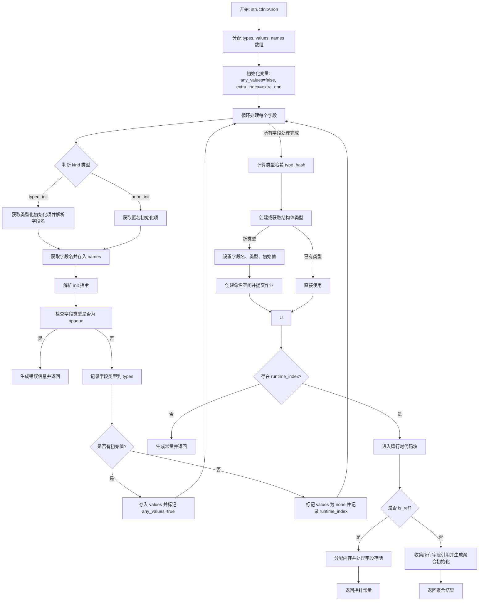

嗯，我现在需要帮用户用Mermaid画出他们提供的Zig函数`structInitAnon`的流程图。首先，我得先仔细阅读并理解这个函数的逻辑。

这个函数看起来是处理结构体初始化的，不管是匿名还是类型化的。函数参数中有个`kind`参数，用来区分这两种情况。流程中需要处理不同类型的初始化项，收集字段的类型、值和名称，然后根据是否有运行时值来决定生成常量还是分配内存。

首先，函数开始的时候会分配内存来存储类型、值和名称。然后遍历每个字段，根据`kind`的不同获取字段名，解析初始化表达式，并检查类型是否为不透明的。如果有不透明类型，会报错。接着，收集字段的类型和值，并记录是否有运行时需要的字段。

接下来，计算类型哈希，创建或获取结构体类型。如果结构体类型是新创建的，需要设置字段名称、类型和初始值，并创建命名空间。如果有现有的类型就直接使用。

之后，如果有运行时需要的字段，就需要生成运行时代码，比如分配内存，处理每个字段的指针，存储值。如果没有运行时字段，就直接返回常量。

我需要把这些步骤分解成流程图的各个节点和判断条件。可能的判断点包括：处理不同`kind`的情况，是否有不透明类型，是否存在运行时索引，是否是引用类型等。

需要注意错误处理的情况，比如当遇到不透明类型时，生成错误信息并返回。还有在处理每个字段时的条件判断，比如是否有初始值，是否需要分配内存等。

流程图的开始是函数入口，然后依次处理各个步骤，每个判断条件分支出不同的路径。最后根据条件返回不同的结果，如常量或分配的内存引用。

可能的结构是：

1. 初始化变量（types, values, names）
2. 遍历每个字段，处理字段名和初始值
3. 检查是否有不透明类型，如果有则报错
4. 收集字段信息，记录运行时索引
5. 计算类型哈希，创建结构体类型
6. 根据是否有运行时索引决定后续处理
7. 如果没有运行时索引，生成常量
8. 如果有，处理运行时分配和字段存储
9. 最后返回结果

需要把这些步骤用Mermaid的流程图语法表示出来，包括条件判断和循环结构。可能需要使用子流程或者分组来简化复杂的部分，比如循环处理字段的部分。
================================================
