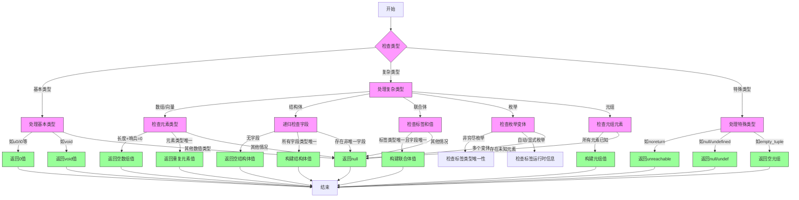

嗯，我现在需要为这个Zig函数`typeHasOnePossibleValue`画一个流程图。首先，我得理解这个函数是做什么的。看起来这个函数是用来判断一个类型是否只有一个可能的值，如果是的话，返回那个值，否则返回null或者错误。这可能在编译器中进行优化或类型检查时用到。

首先，我需要通读代码，理清逻辑结构。函数开始通过`switch (ty.toIntern())`处理不同的类型。对于每个类型，它会返回相应的值或null。比如，`.u0_type`和`.i0_type`返回0，`.void_type`返回`Value.void`，等等。

接下来，对于更复杂的类型，比如数组、结构体、联合体、枚举等，函数会递归检查它们的子类型是否也只有一个可能的值。例如，对于数组类型，会检查其元素类型是否只有一个可能的值；如果是，则整个数组可以用重复的元素来表示。结构体需要检查所有字段的类型是否都只有一个可能的值，如果是，那么结构体的值就是这些字段值的集合。

我需要把这些逻辑分支用流程图表示出来。流程图应该包括开始、结束、判断条件、不同的处理分支，以及可能的递归调用。需要注意的是，有些情况会导致立即返回，而另一些则需要进一步递归处理。

可能会遇到的挑战是处理递归情况，比如结构体中的每个字段都需要调用`typeHasOnePossibleValue`，这时候在流程图中需要表示出这种递归结构。另外，有些类型处理比较复杂，比如枚举类型的不同tag模式（nonexhaustive, auto, explicit）会有不同的逻辑分支。

我需要确保每个`switch`语句的分支都被正确映射到流程图的判断节点，并且每个返回路径都清晰。此外，错误处理和`unreachable`的情况也需要在流程图中标出，可能作为终止节点。

可能还需要注意一些细节，比如`.optional_noreturn_type`返回`try pt.nullValue(ty)`，而其他类型可能直接返回null。对于联合体类型，需要处理标签和值的组合情况。对于元组类型，需要检查所有值是否都是已知的（非none），才能确定其唯一值。

总之，我需要将整个函数的逻辑分解为多个步骤，用条件判断和循环来表示递归调用，确保所有可能的分支都被覆盖，并且流程清晰易懂。
================================================
