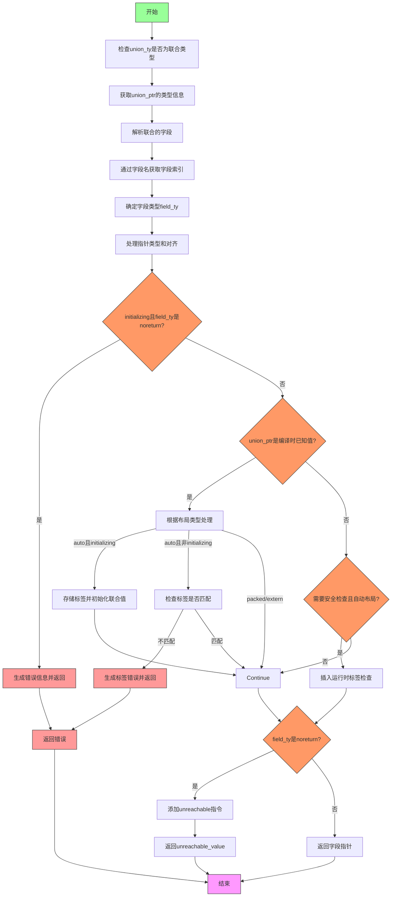

好的，我需要为提供的Zig函数`unionFieldPtr`绘制流程图。首先，我需要仔细阅读代码，理解其逻辑结构。函数的主要目的是处理联合类型的字段指针，包括类型检查、安全性验证以及可能的错误处理。

首先，函数开始时会进行一些基本检查，比如确认`union_ty`确实是联合类型。然后，获取联合指针的类型信息，并解析联合的字段。接着，通过字段名获取字段索引，并确定字段类型。之后处理指针类型的对齐和布局，特别是对于自动布局的联合，需要考虑对齐方式。

接下来，代码处理初始化的情况，如果字段类型是`noreturn`则报错。然后检查联合指针的值，如果是编译时已知值，会根据布局类型（auto、packed、extern）进行不同的处理，比如初始化时设置标签，或者访问时检查标签是否匹配。

如果不在编译时处理，且需要安全检查（比如自动布局的联合），则会插入运行时检查，确保访问的字段是当前活跃的字段，否则触发安全错误。最后，如果字段类型是`noreturn`，则插入`unreachable`指令，否则返回字段指针。

在绘制流程图时，需要将这些步骤分解为不同的节点，并根据条件分支（如`initializing`、布局类型、安全检查是否启用等）连接这些节点。同时，错误处理路径需要单独标出。

需要注意的是，代码中有多个条件判断，例如`initializing`、`layout`类型、`wantSafety()`等，这些都会导致不同的执行路径。此外，编译时值与运行时值的处理方式不同，也需要体现在流程图中。

最后，要确保流程图的逻辑清晰，节点之间的转换正确反映代码的执行流程，包括错误处理和正常返回路径。
================================================
