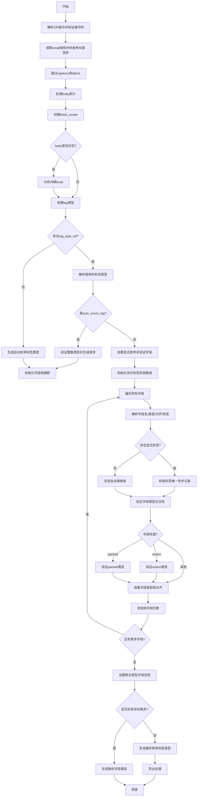

嗯，我需要为这个Zig函数`unionFields`画一个流程图。首先，我得先理解这个函数的结构和逻辑。让我仔细读一遍代码，然后逐步分解它的步骤。

函数一开始用`tracy`进行跟踪，然后定义了一些变量，比如`pt`、`zcu`、`gpa`、`ip`等，这些都是从`sema`或`zcu`获取的。接着从ZIR（Zig Intermediate Representation）中解析`union_decl`指令，确认操作码正确。然后处理`extended`和`small`结构，提取各种长度信息，比如`captures_len`、`body_len`、`fields_len`、`decls_len`等。

接下来，函数跳过captures和decls，处理body部分。然后创建一个`block_scope`，用于后续的语义分析。如果有body内容，会调用`analyzeInlineBody`进行分析。

之后是关于标签类型（tag type）的处理。如果存在`tag_type_ref`，会解析提供的类型，检查是否是整数或枚举类型，并进行相应的错误处理。这里分为自动生成枚举标签和显式指定枚举标签两种情况。

然后处理每个字段（field），包括字段名、类型、对齐方式、标签值等。对于每个字段，会检查类型是否合法（比如不能是opaque类型），并根据不同的布局（extern、packed）进行验证。字段类型和对齐信息被收集到`field_types`和`field_aligns`中。

最后，设置联合类型的字段类型和对齐，处理枚举标签的生成，检查是否有缺失的字段，并调用`sema.flushExports()`。

现在需要把这些步骤转化为流程图。流程图应该包括主要的分支和循环结构，比如条件判断（是否有tag_type_ref，是否有auto_enum_tag等），循环处理每个字段，错误处理路径等。

可能的节点包括：
1. 开始
2. 解析ZIR指令
3. 提取各种长度信息
4. 处理body
5. 处理tag类型
6. 遍历每个字段
7. 检查字段类型和标签
8. 收集字段信息
9. 设置最终类型信息
10. 结束

需要特别注意错误处理的分支，比如类型检查失败时的错误消息生成和返回。

可能的分支条件包括：
- `small.has_tag_type`是否存在标签类型
- `small.auto_enum_tag`是否是自动生成枚举标签
- 字段处理中的各种条件（has_type, has_align, has_tag）
- 显式标签检查是否存在重复或缺失

循环结构主要是遍历所有字段的`while`循环。

在绘制流程图时，需要将这些步骤和条件用适当的形状（如菱形表示判断，矩形表示操作）连接起来，确保逻辑清晰，覆盖所有主要路径和错误处理路径。
================================================

流程图说明：
1. 从解析ZIR指令开始，逐步提取元数据
2. 通过条件分支处理不同标签类型场景（显式/自动生成）
3. 字段遍历阶段包含类型检查、标签验证和布局验证
4. 最终处理标签完整性和类型生成
5. 包含错误处理路径（缺失字段、类型不匹配等）
6. 使用菱形节点表示条件判断，矩形节点表示操作步骤
7. 箭头方向表示程序执行流程走向