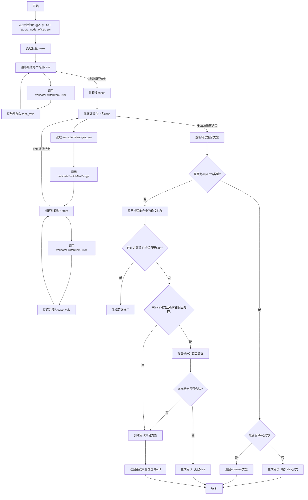

好的，我需要为这个Zig函数`validateErrSetSwitch`画一个流程图。首先，我得仔细阅读并理解这个函数的结构和逻辑。这个函数看起来是用于验证错误集合的switch语句，处理各种case情况，包括标量case和多个case，以及else分支。

首先，函数开始部分初始化了一些变量，比如gpa、pt、zcu、ip等。然后获取了源节点偏移量src_node_offset和src。接下来有两个主要的循环部分，分别处理scalar_cases和multi_cases。每个循环中都会调用validateSwitchItemError来验证每个case的值，并将结果添加到case_vals数组中。对于multi_cases，还需要处理items和ranges，并调用validateSwitchNoRange来确保没有范围的情况。

处理完所有case之后，函数通过resolveInferredErrorSetTy来确定错误集合类型。如果类型是anyerror，则需要检查是否有else分支，如果没有则报错。如果有else分支，返回anyerror类型。如果不是anyerror类型，则会进一步检查是否有未处理的错误名称，并生成相应的错误信息。如果有未处理的错误且没有else分支，会提示错误。如果有else分支但所有错误已经被处理，需要检查else分支是否合法，比如是否是unreachable或者其他允许的模式，否则报错。

最后，如果存在未处理的错误名称，创建一个错误集合类型返回，否则返回null。

在画流程图时，需要将这些步骤分解成不同的节点，并用箭头表示流程。包括初始设置、处理标量case、处理多case、解析错误类型、检查else分支、生成错误信息、最终返回类型等步骤。需要注意条件判断的分支，如是否有else，错误集合类型是否为anyerror，是否有未处理的错误名称等。

可能还需要处理错误路径，比如在errdefer中释放错误信息。不过流程图主要关注主流程，错误处理可以作为分支节点。

需要确认每个条件判断的出口，例如如果满足某个条件则跳转到相应处理步骤，否则继续后续流程。比如，在switch语句中根据错误类型的不同执行不同的逻辑，这需要分支出不同的路径。

总结来说，流程图的大致结构如下：
1. 开始
2. 初始化变量
3. 处理标量cases
4. 处理多cases
5. 解析错误集合类型
6. 判断是否为anyerror类型
   - 是：检查是否有else，没有则报错，有则返回anyerror
   - 否：检查未处理的错误名称，生成错误信息或继续处理
7. 检查else分支是否合法（如是否包含所有错误）
8. 返回相应的类型或null

在绘制时，需要将这些步骤用合适的形状表示（如矩形表示操作，菱形表示判断），并用箭头连接流程。注意循环结构和条件分支的正确表示。
================================================
