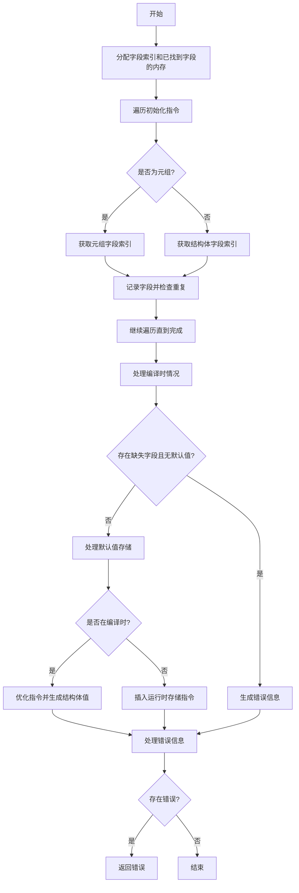

嗯，我现在需要为这个Zig函数`validateStructInit`画一个流程图。首先，我需要理解这个函数的功能和结构。看起来这个函数是用来验证结构体的初始化的，可能包括检查字段是否正确初始化，处理默认值，处理编译时和运行时的不同情况等。

首先，我会通读代码，了解函数的主要步骤。函数开始于分配一些内存用于存储字段索引和已找到的字段。然后遍历所有初始化指令，处理每个字段的指针，记录哪些字段已经被初始化。接着，处理缺失的字段，检查是否有默认值，如果没有则生成错误信息。之后，处理编译时的情况，可能需要替换或优化指令。最后，处理运行时的情况，插入必要的存储指令。

接下来，我需要将这些步骤分解为流程图的各个节点。可能的主要步骤包括：

1. 分配内存用于字段索引和已找到的字段。
2. 遍历初始化指令，记录每个字段的信息。
3. 检查是否所有字段都已正确初始化，处理缺失字段。
4. 处理编译时的情况，优化指令并生成结构体值。
5. 处理运行时的情况，插入默认值的存储指令。
6. 错误处理，生成错误信息。

同时，需要注意条件分支，例如是否在编译时、是否存在默认值、字段是否缺失等。这些条件会导致不同的处理路径。

然后，我需要将这些步骤和条件用mermaid的流程图语法表示出来。需要注意的是，流程图的节点和箭头需要清晰展示函数的执行流程，包括循环、条件判断和错误处理。

在绘制过程中，可能会遇到一些复杂的部分，例如处理编译时和运行时的不同逻辑，需要确保这些部分在流程图中正确表示。另外，错误处理部分需要明确错误信息的生成和传递路径。

最后，检查流程图是否覆盖了函数的所有主要路径，并且逻辑正确，没有遗漏重要的步骤或条件。
================================================
