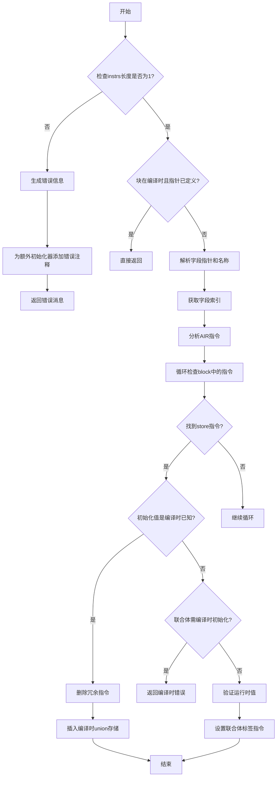

嗯，我需要帮用户把这段Zig代码的流程图用Mermaid画出来。首先，我需要理解这个函数validateUnionInit的功能。看起来这个函数是用来验证联合体（union）的初始化的。函数参数里有Sema、Block、联合体类型、初始化源位置、指令数组和联合体指针等。

首先，函数检查instrs的长度是否为1。如果不是，就生成错误信息，提示不能同时初始化多个联合体字段。这里需要处理多个初始化器的情况，添加错误注释，并返回错误消息。这部分应该对应流程图中的一个判断分支，处理错误情况。

接下来，如果块是在编译时（comptime）且联合体指针已经有定义的值，就直接返回，不需要做其他操作。这应该是另一个条件判断，直接结束流程。

然后，获取第一个字段指针，解析字段名称，并检查字段索引是否存在。如果字段不存在，可能会返回错误。这里可能需要处理字段索引获取失败的情况，但代码中没有明显的错误处理，可能是在sema.unionFieldIndex函数内部处理了。

接下来，分析AIR指令，查找存储（store）指令，判断是否在编译时已知。如果字段类型只有一个可能的值，则直接使用该值。这部分可能涉及多个循环和条件判断，需要跟踪block中的指令，找到相关的store和field_ptr指令。

如果初始化值存在（init_val不为空），则删除所有相关的field_ptr和store指令，插入一个新的store指令，将编译时已知的联合体值存储到指针。否则，如果联合体只能在编译时初始化，返回错误。最后，如果没有编译时值，就验证运行时值，并设置联合体的标签。

整个流程需要分解为多个步骤和条件判断。可能需要将每个主要步骤转化为流程图中的节点，并用条件分支连接。例如，开始于检查instrs长度，分支到错误处理或继续执行。然后检查comptime块，分支到直接返回或继续处理字段。接着处理字段指针和存储指令，判断是否有编译时值，分支到不同的处理路径。

需要注意循环处理block中的指令，查找相关的store指令和field_ptr。这部分可能在流程图中表现为一个循环结构，但Mermaid的流程图可能不太适合循环，可能需要用条件判断和子流程来表示。

最后，根据不同的条件，生成对应的操作，如插入store指令、返回错误或设置标签。需要确保所有可能的路径都被覆盖，并用正确的箭头连接起来。

可能还需要考虑异常处理，如errdefer等，但在流程图中可能简化这些部分，专注于主要逻辑流程。总之，需要将代码分解为逻辑块，每个块对应流程图中的一个节点或判断，然后用箭头连接这些节点，形成完整的流程图。
================================================

流程图说明：
1. 首先检查初始化器数量，非1则生成错误
2. 检查编译时初始化是否已完成
3. 解析字段信息并获取索引
4. 逆向遍历指令查找存储操作
5. 根据是否找到编译时值分叉处理：
   - 编译时已知：清理指令并生成优化存储
   - 运行时处理：验证值并生成标签设置
6. 对需要编译时初始化的联合体做额外检查
7. 最终通过不同路径收敛到结束节点