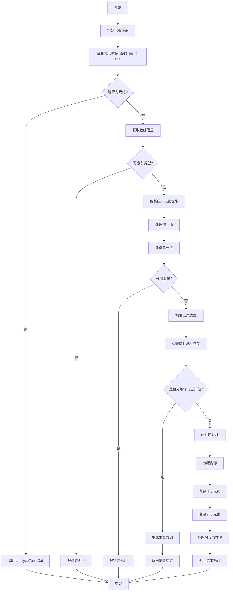

好的，我需要为给定的 Zig 函数 `zirArrayCat` 绘制流程图。首先，我需要仔细阅读并理解这段代码的功能和结构。

函数 `zirArrayCat` 的主要功能似乎是处理数组连接操作。它接收两个操作数（lhs 和 rhs），检查它们的类型（可能是数组或元组），并生成一个新的连接后的数组。代码中涉及到类型检查、错误处理、内存分配、元素复制等步骤。

首先，我需要将整个函数的执行流程分解成主要的步骤：

1. **初始化和追踪**：使用 `tracy` 进行性能追踪。
2. **解析指令数据**：从 ZIR 指令中提取左右操作数（lhs 和 rhs）。
3. **类型判断**：检查 lhs 和 rhs 是否是元组（tuple）。如果是，调用 `analyzeTupleCat`。
4. **获取数组信息**：通过 `getArrayCatInfo` 检查操作数是否为可索引类型，否则报错。
5. **解析元素类型**：通过 `resolvePeerTypes` 确定统一的元素类型。
6. **处理哨兵值（sentinel）**：检查并处理可能的哨兵值不一致情况。
7. **计算结果长度**：将 lhs 和 rhs 的长度相加，处理溢出。
8. **构建结果类型**：根据长度、元素类型和哨兵值创建数组类型。
9. **处理指针地址空间**：确定是否需要处理指针地址空间。
10. **运行时处理**：如果操作数是编译时已知的值，生成常量结果；否则处理运行时逻辑，包括内存分配和元素复制。
11. **返回结果**：返回生成的数组引用。

接下来，我需要将这些步骤组织成流程图的结构，使用 Mermaid 的流程图语法。需要注意条件分支（如是否为元组、是否具有哨兵值、是否在编译时已知值等）和循环（如复制元素到新数组）。

可能的流程如下：

- 开始
- 初始化追踪
- 解析 lhs 和 rhs
- 检查是否为元组 → 是 → 调用 analyzeTupleCat → 结束
- 检查是否为可索引类型 → 否 → 报错
- 确定元素类型
- 处理哨兵值
- 计算总长度，处理溢出
- 构建结果类型
- 检查指针地址空间
- 检查是否为编译时已知值 → 是 → 生成常量数组 → 结束
- 运行时处理：分配内存、复制元素（可能有多个循环分支）
- 返回结果

需要注意错误处理路径，如溢出时报错，类型不符合时报错等。此外，处理元素复制时可能分为两种情况：处理 lhs 的元素和处理 rhs 的元素。

需要确认每个条件分支的流向，以及各个步骤之间的连接是否合理。同时，确保循环结构在流程图中正确表示，例如使用子流程或注释标明循环部分。

最后，根据以上分析，使用 Mermaid 语法绘制流程图，确保节点和箭头正确反映代码的执行逻辑。
================================================
