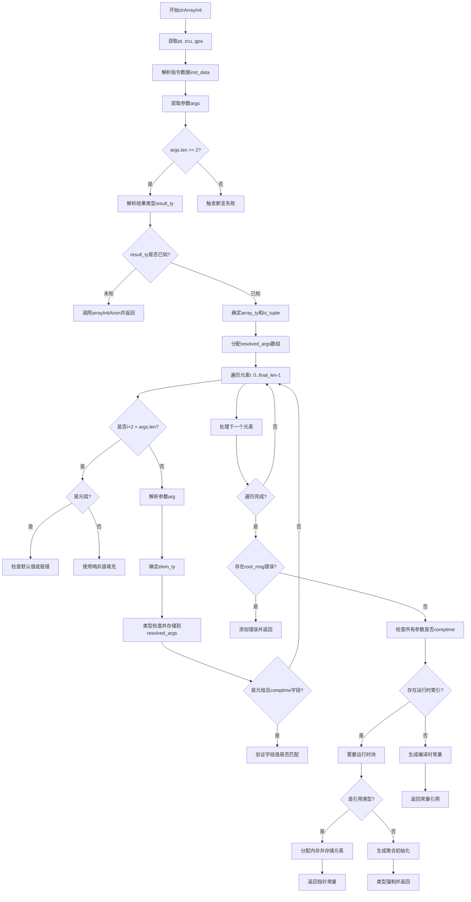

好的，我需要帮用户用Mermaid画出他们提供的Zig函数`zirArrayInit`的流程图。首先，我要仔细理解这个函数的结构和逻辑。

函数`zirArrayInit`似乎负责处理数组或元组的初始化。它接收一些参数，包括Sema、Block、指令索引等，并返回一个Air指令的引用或编译错误。函数内部首先解析类型信息，处理参数，检查是否缺少初始化元素，处理默认值或哨兵值，处理元组和数组的不同情况，最后生成相应的中间表示（IR）指令。

接下来，我需要将这个过程分解成流程图中的各个步骤。首先，函数开始时会获取一些基本的数据结构，比如pt、zcu、gpa等。然后解析指令数据，获取参数。这里有一个断言，确保参数至少有两个：数组类型和至少一个元素。

接下来，处理结果类型，如果类型未知，则调用`arrayInitAnon`。否则，确定数组类型是否是元组，是否有哨兵值。然后分配内存来存储解析后的参数，逐个处理每个参数。这里需要考虑元素是否缺失，是否需要使用默认值或哨兵值填充，并进行类型检查和强制转换。

在处理过程中，如果有错误信息，需要记录并最终返回错误。之后检查是否有需要运行时处理的元素，如果有，则生成相应的运行时分配和存储指令；否则，生成编译时常量。如果是引用类型，还需要处理指针分配和元素存储。最后，返回生成的数组或元组引用。

在绘制流程图时，应该按照函数的执行顺序逐步展开每个判断和循环。例如：

1. 开始函数。
2. 获取基本数据（pt, zcu, gpa）。
3. 解析指令数据，提取参数。
4. 断言参数长度≥2。
5. 解析结果类型，如果未知则调用匿名数组初始化。
6. 确定数组类型是否为元组，是否有哨兵。
7. 分配解析后的参数数组。
8. 遍历每个元素：
   a. 检查元素是否缺失。
   b. 使用默认值或哨兵填充。
   c. 解析参数并进行类型强制。
   d. 如果是元组，检查字段是否为comptime并验证值。
9. 处理错误信息。
10. 检查是否有运行时索引。
11. 如果没有运行时索引，生成编译时常量。
12. 否则，处理运行时分配和存储元素。
13. 如果是引用类型，处理指针分配和存储。
14. 最后，返回生成的数组或元组引用。

需要注意各个条件分支，比如是否为元组、是否有足够的参数、是否缺少字段、是否需要运行时处理等。同时，错误处理部分需要记录错误信息并在适当的时候返回。

在转换为Mermaid图时，使用不同的节点表示步骤，条件判断使用菱形节点，循环使用循环结构。可能需要将循环展开，因为Mermaid的流程图不支持显式的循环语法，但可以用条件判断和子流程来表示。

可能遇到的挑战是如何简洁地表示循环遍历元素和处理每个元素的步骤，以及处理多个条件分支的情况。需要确保流程图清晰，逻辑顺序正确，同时不过于复杂。可以分组处理每个主要步骤，将细节放在子流程中。
================================================

流程说明：
1. 函数初始化并验证参数数量
2. 根据类型是否已知选择匿名初始化或继续处理
3. 遍历每个元素：
   - 处理缺失元素的默认值/哨兵值
   - 类型检查和强制转换
   - 元组字段的特殊处理
4. 错误收集和报告
5. 根据是否包含运行时元素：
   - 完全编译时：生成常量
   - 包含运行时元素：生成内存分配和存储指令
6. 最终返回初始化结果