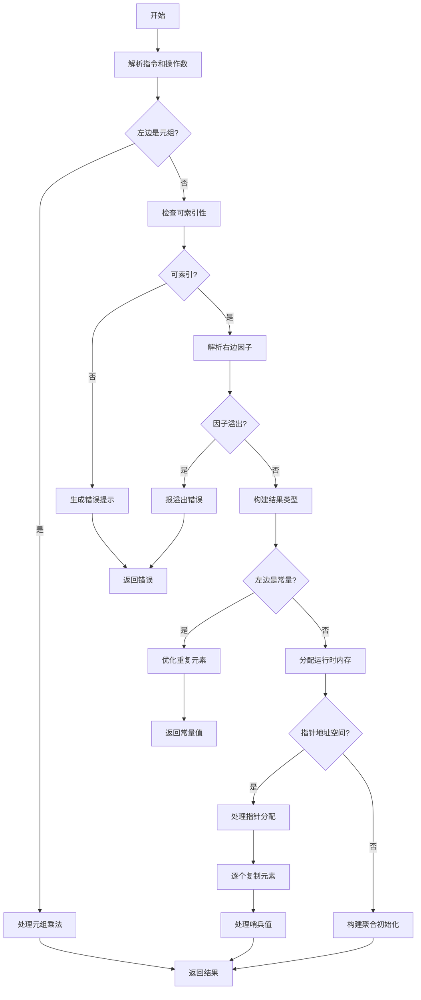

嗯，我需要为这个Zig函数`zirArrayMul`画一个流程图。首先，我得理解这个函数是做什么的。看起来它处理数组乘法操作，比如`**`运算符，用于重复数组元素。函数名中的`ArrayMul`可能指的是数组乘法。

首先，函数开始部分有一些初始化操作，比如获取跟踪器`tracy`，然后解析一些指令数据。接着，它处理左边的操作数`lhs`和右边的操作数`rhs`。可能涉及到类型检查和强制转换，比如检查是否是元组（tuple）类型，然后尝试将其转换为数组或向量。

接下来，函数检查左边的类型是否是元组。如果是，就处理右边的因子（factor），然后调用`analyzeTupleMul`。如果不是元组，继续检查是否是可索引的类型，否则报错，提示期望可索引类型，并可能建议使用数学库中的幂函数。

然后，处理右边的因子，确保它是编译时已知的，并计算结果的数组长度。这里可能有溢出检查，如果溢出就报错。

之后，构建结果类型`result_ty`，并根据左边的类型（指针或切片）处理内存分配和元素复制。如果左边是常量，可能进行优化，比如重复单个元素多次。否则，在运行时处理元素的值，分配内存，并将元素逐个复制进去。

最后，根据是否是指针地址空间，处理指针的分配和元素存储，或者直接构建聚合初始化。

现在，我需要将这些步骤转化为流程图。流程图应该包括主要的判断分支和处理步骤。比如：

1. 开始
2. 解析指令和操作数
3. 检查左边是否为元组，如果是，处理元组乘法
4. 否则，检查是否可索引，不可索引则报错
5. 解析右边的因子，检查溢出
6. 构建结果类型
7. 检查左边是否为常量，进行优化处理
8. 如果是运行时值，分配内存并复制元素
9. 处理指针或直接返回聚合结果

需要注意各个条件分支，如类型检查、常量判断、指针处理等。还要处理错误路径，比如溢出错误和类型不匹配错误。

可能的分支点包括：
- 是否是元组类型
- 是否可索引
- 是否常量值
- 是否有指针地址空间

每个分支对应的处理步骤需要明确。同时，错误处理流程也需要体现在图中，比如报错并返回错误信息。

现在，我需要将这些步骤和分支用Mermaid的流程图语法表示出来，确保逻辑清晰，步骤正确。
================================================
