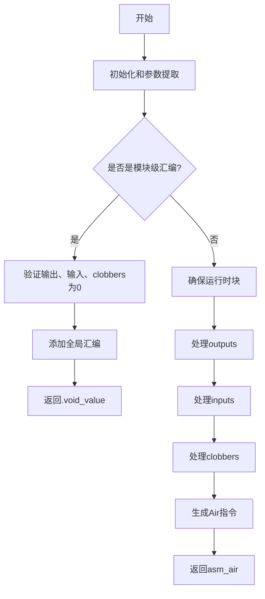
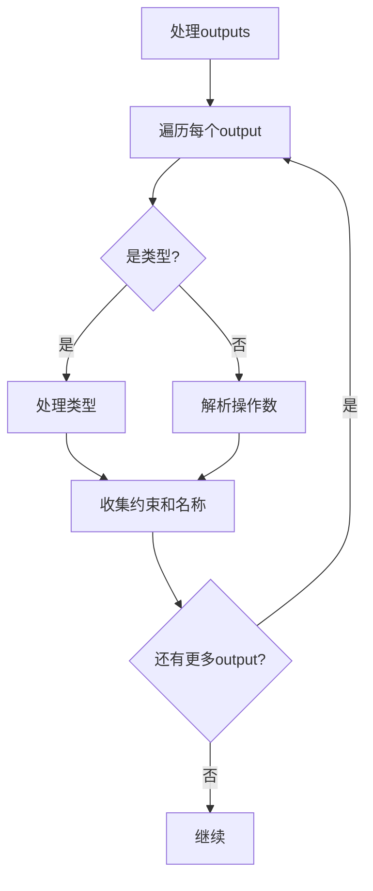

好的，我需要为提供的Zig函数`zirAsm`绘制一个Mermaid流程图。首先，我需要仔细阅读并理解这个函数的结构和逻辑。

函数`zirAsm`的主要功能似乎是处理内联汇编（inline assembly）相关的逻辑。从代码中可以看到，它处理了模块级汇编（global assembly）和普通汇编的不同情况，包括输出、输入、clobbers的校验，以及生成对应的Air指令。

首先，我会将整个函数分解成几个主要步骤：

1. **初始化和参数提取**：函数开始时进行一些初始化操作，比如获取跟踪器（tracy），提取参数如`outputs_len`、`inputs_len`、`clobbers_len`等。
2. **处理模块级汇编**：检查是否是模块级汇编（`is_global_assembly`），如果是，验证没有输出、输入、clobbers，并添加全局汇编。
3. **运行时块校验**：如果不是模块级汇编，需要确保当前块是运行时块。
4. **处理输出（outputs）**：遍历输出，处理类型和参数，收集约束名称，检查可能的错误（如输出到const局部变量）。
5. **处理输入（inputs）**：遍历输入，解析操作数，处理类型转换（如comptime_int转usize）。
6. **处理clobbers**：收集clobber名称。
7. **生成Air指令**：组装所有信息到Air.Asm结构中，填充额外的数据到`air_extra`数组中。

接下来，我需要将这些步骤转化为Mermaid流程图的节点和分支。需要注意的是条件判断和循环结构，比如`if (is_global_assembly)`、各个循环处理outputs、inputs、clobbers等。

可能的节点包括：

- 开始节点
- 初始化参数
- 判断是否是模块级汇编
  - 是：验证输出、输入、clobbers为0，添加全局汇编，返回void_value
  - 否：继续处理
- 确保运行时块
- 处理outputs循环
- 处理inputs循环
- 处理clobbers循环
- 生成Air指令
- 返回结果

在绘制过程中，需要注意每个条件分支的正确连接，以及循环结构的正确表示。例如，处理outputs、inputs、clobbers时，每个循环需要遍历对应长度的元素，可能使用Mermaid的子流程或循环标记。

另外，代码中有多个错误处理路径（如`return sema.fail(...)`），这些也需要在流程图中体现为终止节点或错误处理分支。

由于Mermaid的流程图语法相对简单，可能需要将复杂的逻辑拆分为多个步骤，并用条件判断连接。例如：



但这样可能过于简化，需要进一步细化每个处理步骤中的循环和条件判断。例如，处理outputs时，需要遍历每个output，检查是否是类型，处理约束和名称，并检查可能的错误。

可能需要将每个循环展开为子流程，例如：



同样适用于inputs和clobbers的处理。

综合以上分析，最终的Mermaid流程图需要覆盖所有主要步骤、条件判断和循环，同时合理处理错误路径。需要确保每个步骤之间的连接正确，逻辑清晰。
================================================
```mermaid
flowchart TD
    A[开始] --> B[初始化和参数提取]
    B --> C{是模块级汇编?\n(is_global_assembly)}
    C -->|是| D[验证outputs_len=0]
    D --> E[验证inputs_len=0]
    E --> F[验证clobbers_len=0]
    F --> G[添加全局汇编]
    G --> H[返回.void_value]
    
    C -->|否| I[确保运行时块\n(requireRuntimeBlock)]
    I --> J[准备输出参数]
    J --> K[遍历outputs]
    K --> L{当前output是类型?}
    L -->|是| M[处理类型\n设置arg为none]
    L -->|否| N[解析操作数\n(resolveInst)]
    M --> O[收集约束和名称]
    N --> O
    O --> P{还有更多output?}
    P -->|是| K
    P -->|否| Q[准备输入参数]
    
    Q --> R[遍历inputs]
    R --> S[解析操作数]
    S --> T{类型是comptime_int/comptime_float?}
    T -->|是| U[类型转换\n(coerce)]
    T -->|否| V[保留原值]
    U --> W[收集约束和名称]
    V --> W
    W --> X{还有更多input?}
    X -->|是| R
    X -->|否| Y[处理clobbers]
    
    Y --> Z[遍历clobbers]
    Z --> AA[收集名称]
    AA --> AB{还有更多clobber?}
    AB -->|是| Z
    AB -->|否| AC[生成Air指令]
    
    AC --> AD[组装Air.Asm结构]
    AD --> AE[填充extra数据]
    AE --> AF[返回asm_air]
    
    style A stroke:#333,stroke-width:2px
    style H stroke:#f00
    style AF stroke:#090
```