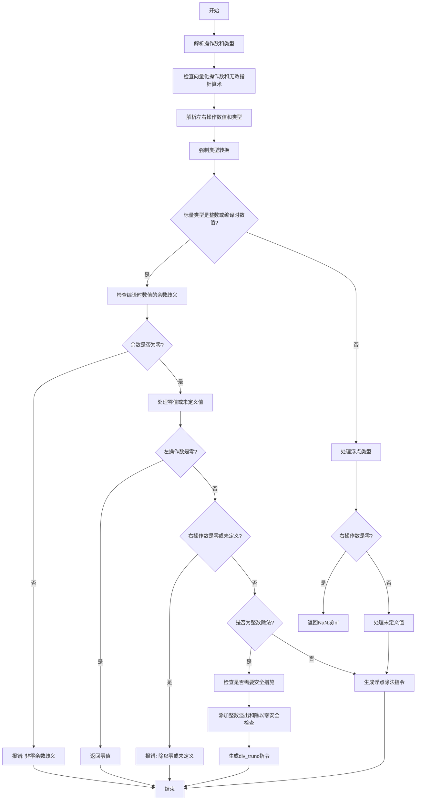

嗯，我需要用Mermaid来画这个Zig函数的流程图。首先，我得理解这个函数是做什么的。看起来这个函数处理的是除法操作，可能是编译器的一部分，进行类型检查和生成中间代码（Air指令）。

首先，函数开始时会解析左右操作数，获取它们的类型和源代码位置。然后进行一系列检查，比如向量化操作数、无效指针算术等。接着，处理类型强制转换，确保左右操作数类型一致。之后，根据操作数的类型（整数或浮点数）进行不同的处理，比如检查除以零的情况，处理未定义值，以及整数溢出的安全措施。最后生成对应的Air指令。

接下来，我需要将这些步骤转化为流程图的结构。可能需要分几个主要块：初始化、类型检查与转换、值解析与检查、错误处理、生成指令等。每个判断条件（比如是否是整数类型、是否有未定义值等）都需要分支。

需要注意的是，代码中有很多条件判断，比如switch语句和if条件，这些都需要在流程图中体现出来。比如，当检查到除以零时，会触发错误；当操作数是整数时，需要检查是否需要安全措施等。

可能还需要处理特殊情况，比如编译时的浮点数和整数的混合运算，这时候会有额外的余数检查，以避免歧义。此外，处理未定义值的情况也需要特别分支。

流程图的大致结构可能是这样的：

1. 开始
2. 解析操作数和类型
3. 检查操作数有效性（向量化、指针算术）
4. 解析左右操作数的值和类型
5. 强制类型转换
6. 检查是否是整数或浮点数
7. 处理特殊情况（编译时数值、余数检查）
8. 检查除以零和未定义值
9. 添加运行时安全检查（溢出、除以零）
10. 生成对应的Air指令
11. 错误处理分支

每个步骤中的条件判断会导致不同的路径，比如如果检查到除以零，流程直接跳到错误处理；如果所有检查通过，生成指令。

现在需要将这些步骤转化为Mermaid的流程图语法，使用节点和条件判断箭头。需要注意的是，Mermaid中的条件判断可以用菱形节点表示，根据不同的条件转向不同的分支。

可能遇到的困难是代码中的嵌套条件较多，需要合理组织流程图的结构，避免过于复杂。可能需要将某些步骤合并或分块处理，以保持流程图的可读性。

另外，需要注意代码中的注释部分，比如TODO部分提到的处理整数除法时的歧义结果，可能在流程图中也需要体现出来，或者暂时标记为未实现。

总结来说，需要将函数的主要步骤和条件分支拆解出来，用Mermaid语法绘制出清晰的流程图，反映函数的逻辑结构。
================================================

注：此流程图简化了部分复杂逻辑（如未定义值处理的分支嵌套），聚焦于核心流程。实际代码中的部分条件（如`signed int`检查、编译时值特殊处理）被合并到关键判断节点中。