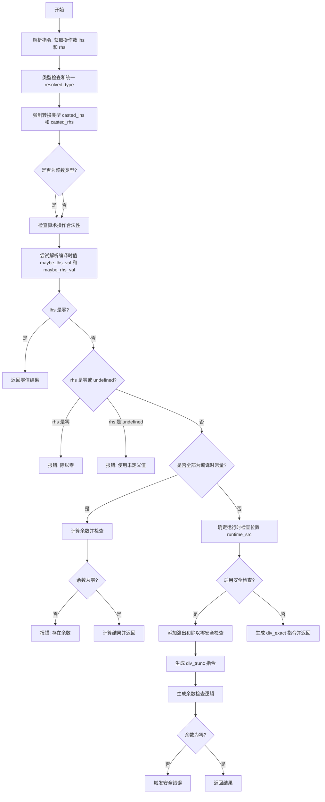

嗯，我需要用Mermaid来画出这个Zig函数的流程图。首先，我得仔细看看这个函数是做什么的。函数名为zirDivExact，看起来是处理精确除法的语义分析部分。

首先，函数开始处有一些变量初始化，比如获取pt、zcu、inst_data等。然后获取左右操作数的源代码位置lhs_src和rhs_src。接着解析左右操作数的指令，得到lhs和rhs，并检查它们的类型是否合法，比如向量化操作数和指针算术的有效性。

接下来，函数尝试统一左右操作数的类型，并进行类型强制转换，得到casted_lhs和casted_rhs。然后判断操作数是否为整数类型，检查算术操作的合法性。

之后，函数尝试解析左右操作数的值，如果可能的话。这里有很多条件判断，比如如果左操作数是0，则直接返回0；如果右操作数是0，则报除以零的错误；如果操作数是undefined，则报错。这部分涉及到编译时的常量折叠和错误检查。

然后，如果左右操作数的值都能在编译时确定，就会进行精确除法的计算，并检查是否有余数。如果有余数，会报错。否则返回计算结果。

如果不能在编译时确定值，就需要生成运行时检查的代码。这里根据是否启用安全检查（safety）来决定生成不同的指令。如果启用安全检查，会添加除法溢出和除以零的安全检查，然后生成div_trunc指令，并检查余数是否为0，如果不是则触发安全错误。

最后，如果没有启用安全检查，直接生成div_exact或优化后的指令。

现在需要把这些步骤转化为流程图。流程图应该涵盖主要的判断分支和处理流程，比如类型检查、常量折叠、错误处理、运行时安全检查等。

可能的步骤：
1. 解析指令，获取操作数。
2. 类型检查和统一。
3. 编译时常量处理（如零值、undefined检查）。
4. 除法计算和余数检查。
5. 运行时安全检查和代码生成。
6. 返回结果或错误。

需要注意条件分支，比如是否在编译时确定值，是否启用安全模式等。每个分支都应该在流程图中体现。

可能需要使用Mermaid的graph TD来组织各个节点，用条件判断和箭头连接不同步骤。例如，判断是否maybe_lhs_val存在，是否maybe_rhs_val存在，是否is_int，是否block.wantSafety()等。

另外，错误处理部分如failWithDivideByZero、failWithUseOfUndef等也需要作为流程中的节点。

最后，将整个流程整理成结构化的流程图，确保逻辑清晰，分支正确。
================================================
