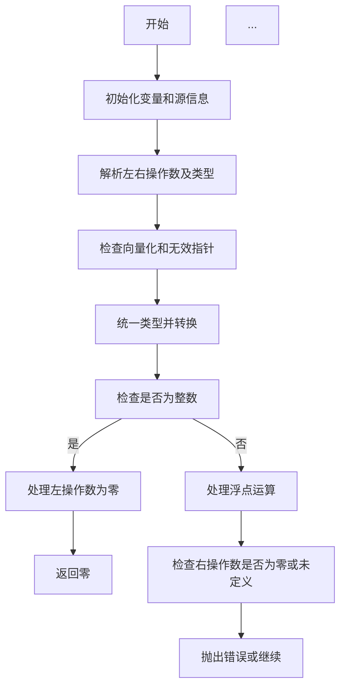
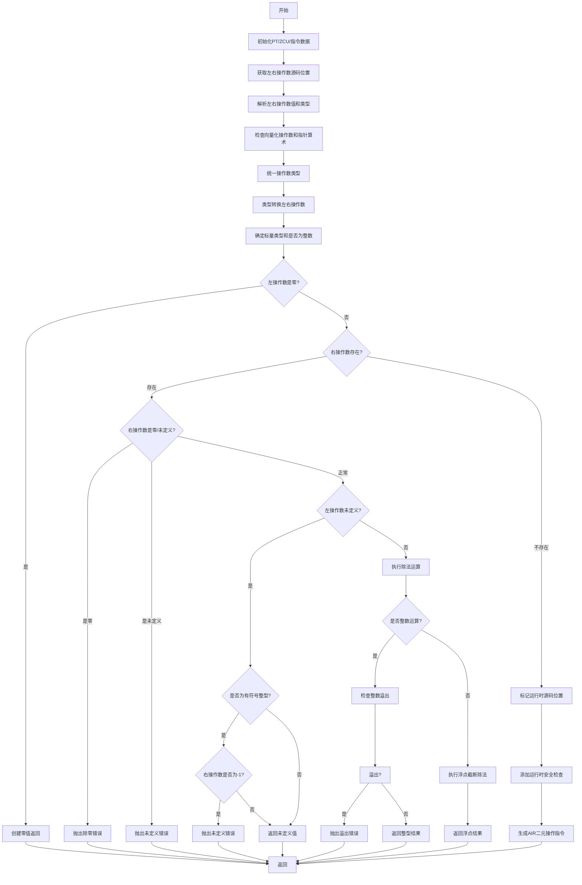

好的，我需要为这个Zig函数`zirDivTrunc`画一个流程图。首先，我得仔细阅读代码，理解每个步骤的作用。

函数开始的时候，获取了各种指针和上下文信息，比如`sema`、`block`、`inst`等。然后从指令中提取数据，获取源代码位置信息，处理左右操作数。接下来检查操作数是否是向量化的，以及无效的指针算术。

然后，函数尝试解析左右操作数的类型，并进行类型转换以确保类型一致。接着检查操作数是否为整数类型，并验证算术运算的有效性，比如是否除以零，或者是否有整数溢出。

在处理可能的值时，函数考虑了各种情况：如果左操作数是零，直接返回零；如果右操作数是零或未定义，会抛出错误；如果左操作数未定义，根据类型不同处理方式不同。对于整数除法，还需要处理溢出情况，而浮点数则有不同的处理方式。

最后，如果需要运行时检查，添加相关的安全检查，并生成对应的Air指令。

现在，我需要把这些步骤转化为流程图。可能需要分为几个主要部分：初始化、类型检查和转换、值处理、错误检查、安全措施，以及最终的指令生成。每个部分内部有判断分支，比如是否为零、是否未定义、是否整数等。

需要注意的是，代码中有多个条件判断，比如`if (maybe_lhs_val)`、`if (maybe_rhs_val)`、`if (is_int)`等，这些都需要在流程图中用条件分支表示。此外，错误处理部分如`failWithDivideByZero`或`failWithUseOfUndef`也要作为分支的结果。

可能的结构是：

1. 开始
2. 初始化变量和获取源信息
3. 解析左右操作数及其类型
4. 检查向量化和无效操作
5. 解析和统一类型
6. 类型转换
7. 检查是否为整数或浮点
8. 处理左操作数为零的情况
9. 检查右操作数为零或未定义
10. 处理左操作数未定义的情况
11. 处理整数溢出和浮点运算
12. 添加运行时安全检查
13. 生成Air指令
14. 结束

每个判断步骤会有不同的分支，例如在第8步，如果左操作数为零，直接返回零；否则继续检查右操作数。

需要确保所有可能的执行路径都被覆盖，包括错误路径。这可能需要多个条件节点和结果节点。同时，注意循环或递归的情况，但在这个函数中似乎没有。

可能使用Mermaid的流程图语法，用矩形表示步骤，菱形表示条件判断，箭头表示流程方向。例如：

需要更详细地展开每个判断和操作，确保所有条件分支都被正确表示。特别是处理未定义值和不同类型的路径。

最后，整合所有步骤，形成一个完整的流程图，确保逻辑正确且易于理解。
================================================
