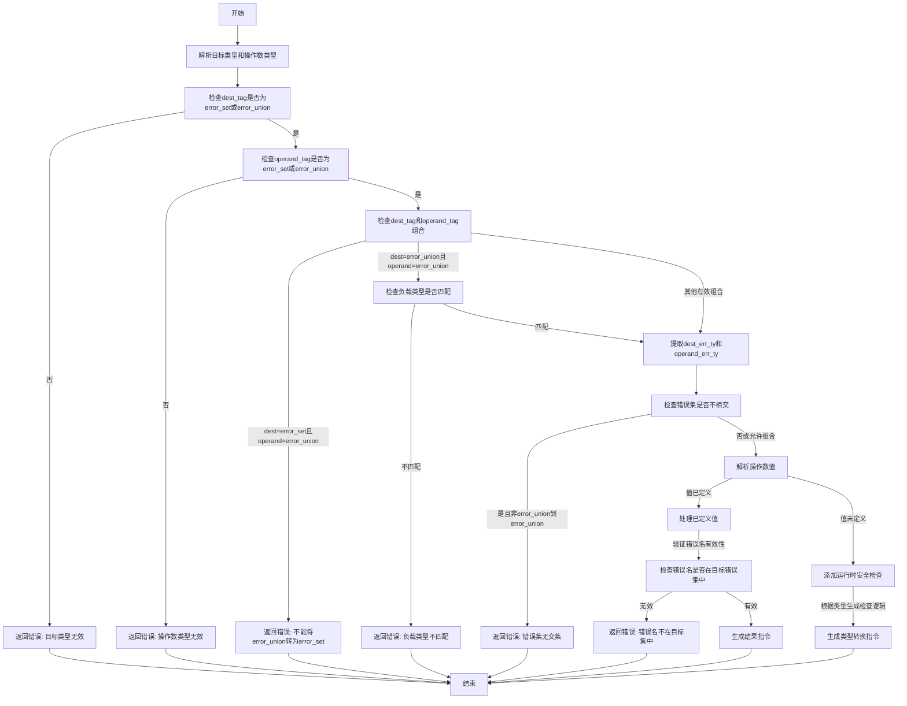

嗯，我需要为这个Zig函数`zirErrorCast`画一个流程图。首先，我得仔细阅读代码，理解它的逻辑结构和各个条件分支。这个函数看起来是关于错误类型转换的，处理错误集和错误联合类型的转换。

首先，函数开始时会解析目标类型`dest_ty`和操作数类型`operand_ty`。然后检查它们的类型标签，必须是错误集或错误联合类型。如果不符合，会返回相应的错误。接下来，处理不同情况，比如目标类型是错误集而操作数是错误联合时，不允许转换。如果都是错误联合，但负载类型不匹配，也会报错。

然后，函数检查错误集之间是否有交集，如果没有且不是特定的情况，就会报错。接着处理操作数的值，确保错误代码有效，并生成相应的Air指令。最后根据不同的类型组合生成不同的转换指令。

我需要将这些步骤分解成流程图中的各个节点，包括条件判断和可能的错误路径。要注意每个条件分支，比如`dest_tag`和`operand_tag`的不同组合，以及如何处理错误情况。同时，要理清各个步骤之间的顺序和依赖关系。

可能遇到的难点是处理复杂的条件分支，比如`disjoint`变量的计算，以及后续的安全检查部分。需要确保每个判断都正确反映在流程图中，并且流程图的路径清晰，不会遗漏任何可能的执行路径。此外，代码中有一些递归或依赖其他函数的部分，比如`resolveInferredErrorSetTy`，但流程图可能不需要深入到这些函数的内部，只需表示调用点即可。

最后，需要将所有这些逻辑用mermaid的流程图语法表示出来，确保每个步骤和条件都正确对应，结构合理，易于理解。
================================================

流程图说明：
1. 流程从类型解析开始，逐步进行类型合法性验证
2. 通过多个条件分支处理不同类型组合的约束
3. 对运行时值进行安全检查（当值未定义时）
4. 最终生成对应的IR指令或返回错误
5. 黄色菱形表示条件判断，蓝色矩形表示操作步骤，红色矩形表示错误路径
6. 覆盖了代码中所有主要错误检查和类型转换路径