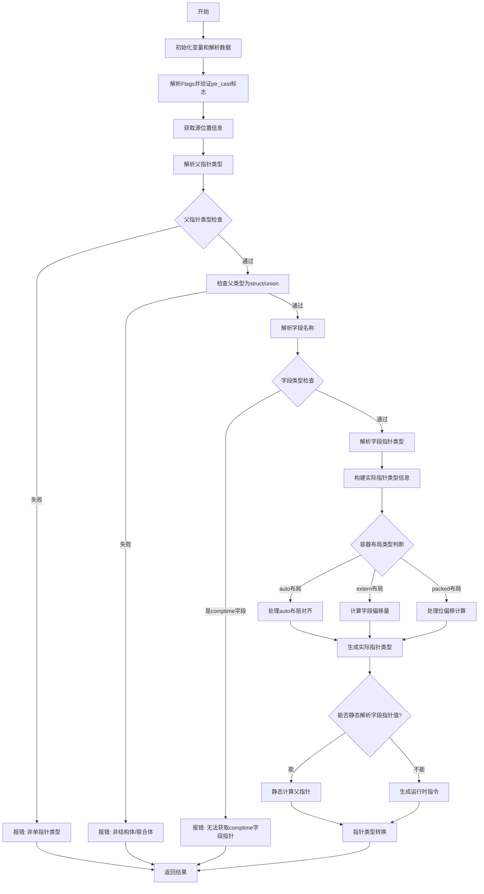

好的，我需要为给定的Zig函数`zirFieldParentPtr`绘制一个流程图。首先，我需要理解这个函数的结构和逻辑流程。

函数的主要步骤似乎包括：

1. **初始化变量和解析输入数据**：从`extended`操作数中提取额外数据，处理标志位，确定源位置等。
2. **类型检查和验证**：验证`parent_ptr_ty`是否为单指针，指向结构体或联合体，检查字段是否存在，以及字段是否为编译时字段等。
3. **处理不同类型的容器布局**：根据结构体或联合体的布局（auto、extern、packed）进行不同的指针偏移计算和对齐处理。
4. **生成结果**：根据是否能在编译时解析值，生成相应的Air指令或进行指针转换。

接下来，我需要将这些步骤转化为流程图的各个节点。可能的分支包括：

- 检查`parent_ptr_ty`的类型是否合法（是否为单指针，指向结构体或联合体）。
- 检查字段是否为编译时字段（如果是，报错）。
- 根据容器布局（auto、extern、packed）处理不同的指针偏移和对齐方式。
- 根据是否能在编译时解析`field_ptr`的值，生成编译时结果或运行时指令。

需要注意错误处理的情况，如类型不符合预期时的`fail`调用。

最后，将这些逻辑步骤用Mermaid的流程图语法组织起来，确保每个判断和操作都有对应的节点和箭头，正确反映函数的执行流程。
================================================
