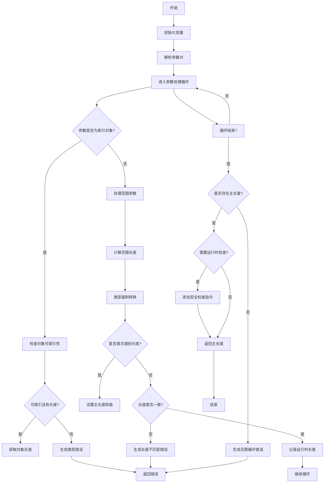

嗯，我需要用Mermaid画出这个Zig函数的流程图。首先，我得理解这个函数的结构和逻辑。这个函数是处理for循环的长度检查的，对吧？

首先，函数开始时会做一些初始化，比如获取pt、zcu、gpa等变量。然后解析指令数据，获取所有参数对。接着进入第一个循环，遍历每个参数对，检查它们是索引对象还是范围。如果是索引对象，检查是否可索引，是否有长度属性；如果是范围，计算起始和结束的差值作为长度。这里可能会有错误处理，比如类型不可索引或者长度不匹配的情况。

接下来，处理完所有参数对后，如果没有找到任何长度（len == .none），则生成错误信息，指出无限循环的问题，并列出所有没有上界的参数。如果有多个运行时长度需要检查，并且需要安全检查的话，会添加比较指令来确保所有长度相等，否则触发安全错误。

我需要把这些步骤转化为流程图。首先确定主要的流程节点，比如初始化、参数处理循环、错误检查、运行时安全检查等。每个判断点需要分支，比如参数是否可索引、是否有长度、长度是否一致等。错误情况需要用不同的路径表示，比如生成错误信息并返回。

需要注意的是循环结构，比如遍历arg_pairs的循环，可能需要用循环节点表示。Mermaid中可以用子图或者循环标记来处理。同时，错误处理部分可能会有多个分支，每个错误情况都要有对应的处理步骤。

可能还需要考虑变量的初始化和条件判断的顺序。比如，第一次循环处理所有参数对，确定len和len_val，然后根据是否有运行时参数进行安全检查。最后返回len。

在画流程图的时候，要确保每个步骤之间的逻辑关系清晰，判断条件明确。可能还需要标注各个步骤对应的代码部分，比如错误消息的生成，安全检查和循环处理等。

总之，我需要将代码分解成主要步骤，识别条件和循环，然后转化为Mermaid的节点和箭头，确保流程正确反映函数的执行路径。
================================================
