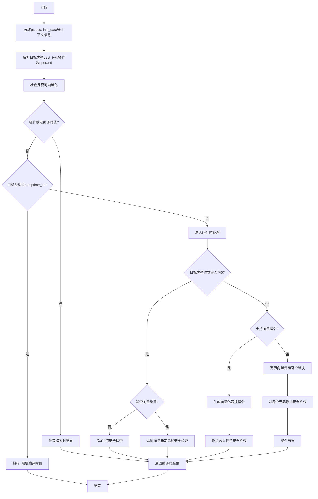

好的，我需要为给定的Zig函数`zirIntFromFloat`绘制一个流程图。首先，我需要理解这个函数的结构和逻辑流程。让我先通读代码，理解每个步骤的作用。

函数的主要目标似乎是将浮点数转换为整数，可能涉及到类型检查、错误处理以及不同情况下的处理逻辑，比如向量化操作、编译时和运行时的不同处理等。

首先，函数开始处获取了一些上下文信息，比如`pt`、`zcu`，然后解析指令数据，获取源节点和操作数。接着，解析目标类型和操作数，检查是否可向量化，并确定是否是向量类型。

然后，函数处理标量类型，检查整数和浮点类型是否符合要求。如果操作数是编译时已知的值，直接计算结果；如果目标类型是编译时整数，则可能需要失败并提示需要编译时信息。

接下来，处理运行时的情况，特别是当目标类型的整数位数为0时的特殊情况，这里可能涉及到安全检查，比如确保浮点数为0，否则报错。

对于非零位数的整数类型，根据是否为向量类型以及后端是否支持向量指令，生成相应的转换操作，并在需要时添加安全检查，确保转换后的整数没有超出范围。

如果后端不支持向量指令，则逐个处理向量中的每个元素，进行转换和安全检查，最后聚合结果。

现在，我需要将这些步骤转化为流程图。流程图应该包括开始和结束节点，各个主要处理步骤，条件判断（如是否为向量类型、是否支持向量指令、是否需要安全检查等），以及可能的错误处理路径。

需要注意的是，代码中有多个条件分支，比如`if (try sema.resolveValue(operand))`、`if (dest_scalar_ty.intInfo(zcu).bits == 0)`、`if (!is_vector or zcu.backendSupportsFeature(.all_vector_instructions))`等，这些都需要在流程图中体现为判断节点。

此外，错误处理部分，如`try sema.failWithNeededComptime`和`try sema.addSafetyCheck`，也需要在流程图中标注出来，可能作为不同的分支或处理步骤。

最后，需要确保流程图的逻辑与代码的结构一致，步骤清晰，条件判断准确，循环处理（如处理向量元素时的循环）也需要适当表示。
================================================
