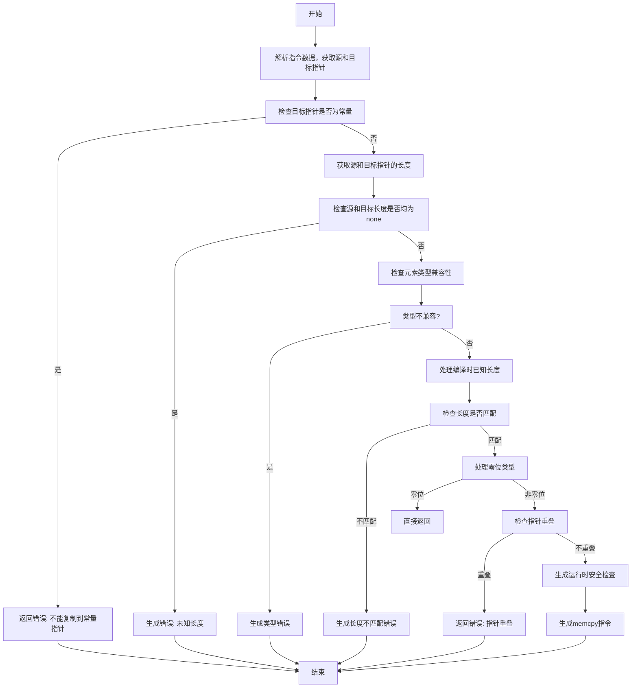

好的，我需要帮用户用Mermaid画出一个Zig函数的流程图。首先，我需要理解这个函数的逻辑。函数名为zirMemcpy，看起来是处理内存复制的，比如@memcpy内置函数的相关语义分析和代码生成。

首先，我应该通读代码，了解主要的步骤和分支。函数开始时获取指令数据，解析源和目标指针，检查它们的类型和长度。然后进行一系列的错误检查，比如目标指针是否是常量、长度是否匹配、元素类型是否兼容等。接着处理零位类型的情况，检查指针是否重叠，生成相应的运行时安全检查，最后生成AIR指令。

接下来，我需要将这些步骤分解成流程图中的各个节点。可能的分支包括错误检查失败时返回错误，处理编译时已知长度的情况，运行时安全检查的条件分支，以及最终的指令生成。

需要注意的是，代码中有多个条件判断，例如检查dest_ty.isConstPtr，dest_len和src_len是否为none，是否wantSafety等。每个条件判断都会导致不同的路径，这些都需要在流程图中体现出来。

另外，函数中有多个可能的返回点，比如在发现错误时直接返回，或者在零位类型的情况下提前返回。这些都需要在流程图中明确标出。

可能遇到的挑战是如何将复杂的条件分支和嵌套的代码结构简化为清晰的流程图。需要确保每个判断节点都有明确的是/否分支，并且步骤之间的连接正确无误。同时，保持流程图的简洁性，避免过于复杂难以理解。

最后，确保流程图的开始和结束点正确，所有的错误处理和正常流程都有合适的路径连接。
================================================
