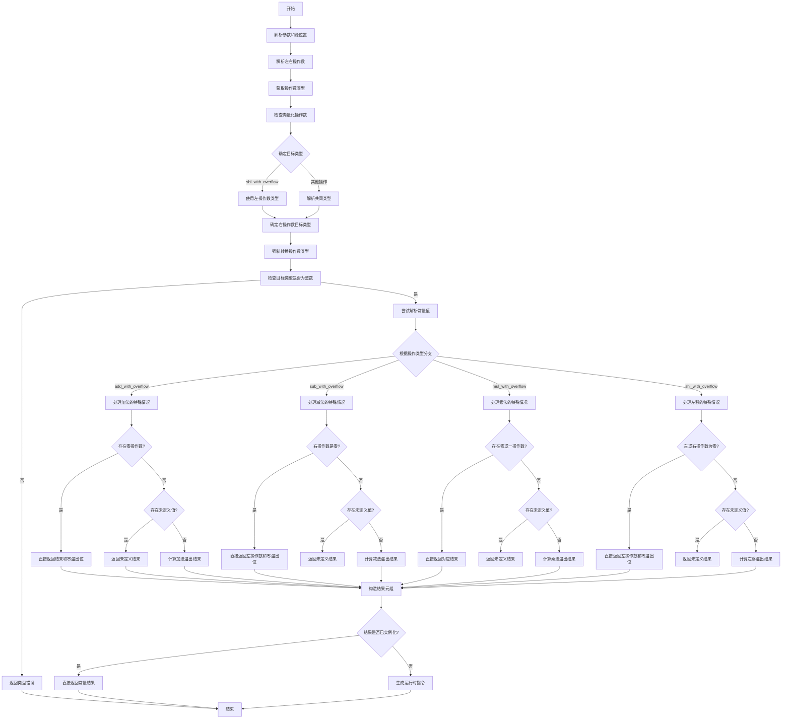

好的，我现在需要为提供的Zig函数`zirOverflowArithmetic`绘制流程图。首先，我需要理解这个函数的功能和结构。该函数处理带有溢出的算术操作，如加法、减法、乘法和左移，并返回结果和溢出位。流程图中需要涵盖函数的主要步骤和分支。

首先，我会通读代码，了解整体流程。函数开始部分处理参数解析和类型检查，接着根据不同的`zir_tag`处理不同的算术操作。每个操作都有特定的逻辑，例如处理零值、未定义值以及计算溢出。最后，函数构造并返回结果。

接下来，我需要确定流程的主要分支和条件。例如，不同的`zir_tag`（如.add_with_overflow、.sub_with_overflow等）会导致不同的处理路径。每个操作内部还有条件判断，比如检查操作数是否为零或未定义，这些都需要在流程图中体现。

然后，考虑错误处理和返回结果的部分。例如，当类型不符合预期时，函数会返回错误。此外，对于常量的优化处理（如直接计算结果而无需运行时指令）也需要在流程图中表示。

需要注意，函数中存在多个返回点，特别是在不同条件下直接返回结果或生成相应的Air指令。这需要在流程图中清晰地展示不同的结束路径。

可能遇到的挑战是如何简洁地表示复杂的条件分支，特别是当多个操作共享相似结构时。需要合理分组这些分支，避免流程图过于复杂。此外，确保所有可能的路径都被覆盖，没有遗漏重要的逻辑步骤。

最后，将整个流程分解为开始、参数处理、类型检查、根据操作类型分支、处理特定操作逻辑、构造结果和结束等步骤。每个步骤用适当的图形（如矩形、菱形表示判断）表示，并用箭头连接，形成完整的流程图。
================================================
