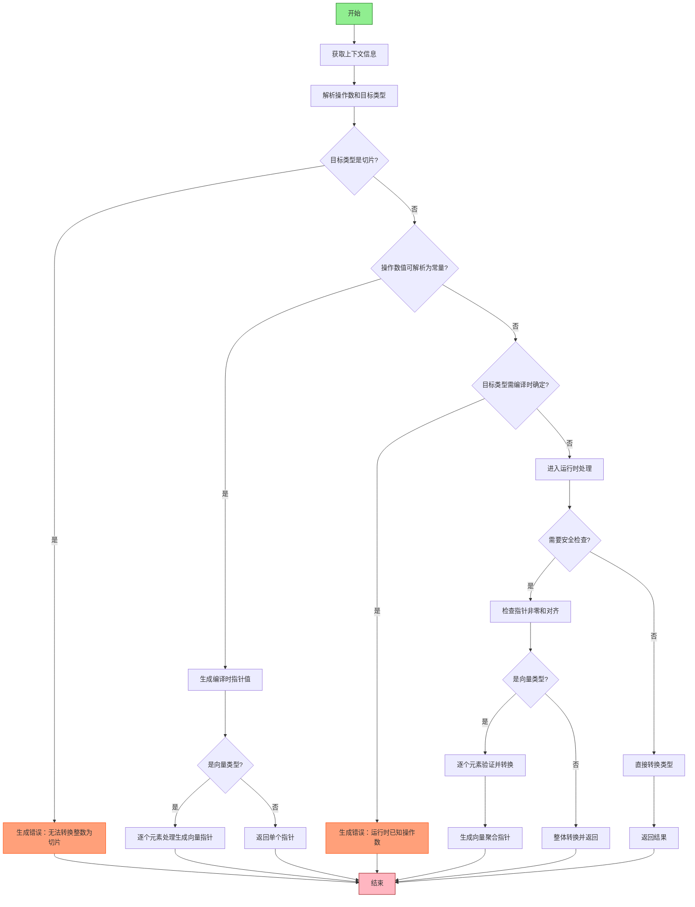

好的，我需要为提供的Zig函数`zirPtrFromInt`绘制流程图。首先，我得仔细阅读代码，理解它的逻辑结构和各个步骤。这个函数的主要功能似乎是将整数转换为指针，同时处理类型检查和安全性验证。

首先，函数开始部分获取了一些上下文信息，比如`pt`、`zcu`、`inst_data`和`src`。然后解析了操作数的源和目标类型，并进行了一些检查，比如向量化二进制操作数的检查。接着处理了不同类型的转换，包括向量类型和非向量类型的不同处理路径。

接下来，函数检查目标类型是否为切片类型，如果是，则返回错误。然后尝试解析操作数的值，如果值是已知的（可能在编译时），则生成相应的指针值。如果目标类型是只能在编译时确定的类型，但操作数是运行时已知的，也会返回错误。

之后，函数处理运行时块的需求，并进行安全性检查，包括指针非零和对齐检查。对于向量类型，可能需要逐个元素处理，并生成相应的聚合初始化。

在绘制流程图时，需要将这些步骤分解为不同的节点，并根据条件分支（如是否为向量类型、是否满足安全条件等）连接这些节点。需要注意错误处理的路径，例如当检测到错误时，如何生成错误消息并返回。

可能的结构如下：
1. 开始节点：函数入口。
2. 获取上下文和解析指令数据。
3. 解析操作数和目标类型。
4. 检查是否为切片类型，是则返回错误。
5. 尝试解析操作数值，若成功则生成指针值。
6. 检查目标类型是否只能在编译时确定，但操作数为运行时，返回错误。
7. 确保运行时块，并进行安全性检查（非零指针、对齐）。
8. 根据是否为向量类型处理元素，生成最终的指针或向量聚合。
9. 结束节点：返回结果或错误。

需要特别注意条件分支，比如`is_vector`的判断，以及错误处理流程。每个条件分支应有不同的路径，可能使用菱形决策节点表示。同时，循环处理向量元素的部分也需要在流程图中体现，可能使用循环结构或重复节点。

可能遇到的挑战是如何简洁地表示复杂的条件逻辑和错误处理，同时保持流程图的可读性。需要合理分组步骤，使用子流程或注释来阐明复杂部分。
================================================
