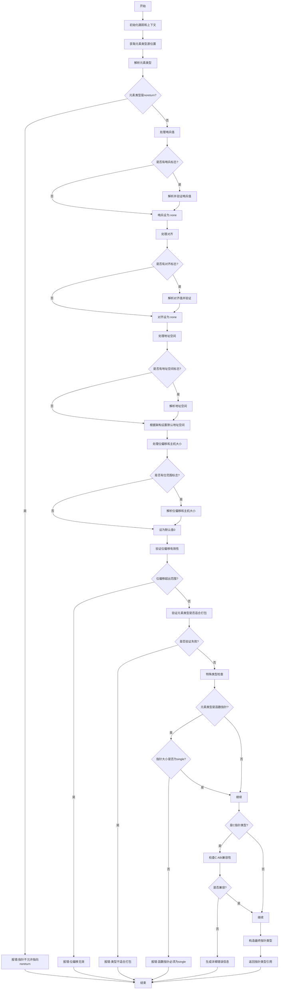

好的，我现在需要为提供的Zig函数`zirPtrType`绘制一个流程图。首先，我需要理解这个函数的结构和逻辑流程。

函数`zirPtrType`的主要作用似乎是处理指针类型的语义分析。它接收多个参数，包括Sema、Block和Zir指令索引，然后执行一系列步骤来验证和构造指针类型。从代码中可以看到，函数首先获取各种源位置信息，然后处理元素类型、哨兵值、对齐方式、地址空间、位偏移和主机大小等参数。

接下来，我需要逐步分析每个代码块的作用，并确定它们之间的逻辑关系。例如：

1. **初始化部分**：使用`tracy`进行性能追踪，获取`pt`和`zcu`等上下文信息。
2. **处理元素类型**：解析元素类型，检查是否为`noreturn`，如果是则报错。
3. **处理哨兵值**：如果有哨兵标志，解析并验证哨兵值。
4. **处理对齐方式**：解析对齐值，验证其有效性。
5. **处理地址空间**：确定地址空间，特别是针对AVR架构的特殊情况。
6. **处理位偏移和主机大小**：解析并验证位偏移和主机大小，确保它们在合理范围内。
7. **函数指针和C指针的特殊处理**：检查元素类型是否为函数或不符合C ABI的情况，进行相应的错误处理。
8. **验证打包类型**：检查主机大小非零时，元素类型是否适合打包。
9. **构造指针类型**：使用所有收集到的信息构造最终的指针类型，并返回结果。

在绘制流程图时，需要将这些步骤按顺序排列，并注意条件分支，例如是否存在哨兵值、对齐标志、地址空间标志等。每个条件判断（如`if (inst_data.flags.has_sentinel)`）都会产生不同的分支路径。

另外，需要注意错误处理部分，例如在解析过程中遇到错误时，如何生成错误消息并返回。例如，处理元素类型时的`catch`块，以及在验证对齐、地址空间等时的错误返回。

最后，确保流程图覆盖所有可能的执行路径，包括正常流程和所有错误情况。需要将每个判断点和可能的路径用条件框表示，并连接相应的处理步骤。

在绘制过程中，可能需要简化某些重复的部分，例如多个类似的条件检查（如处理不同标志的部分），保持流程图的清晰和可读性。同时，使用合适的注释说明关键步骤和条件判断的依据。
================================================
