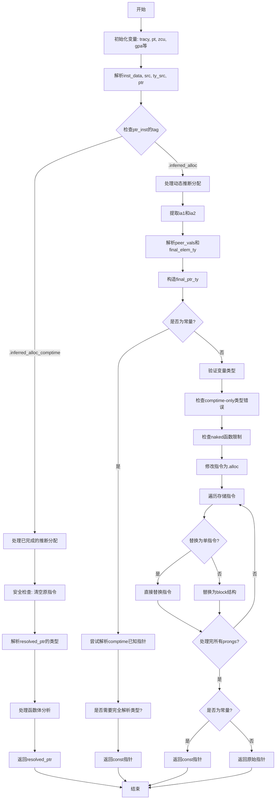

好的，我现在需要为提供的 Zig 函数 `zirResolveInferredAlloc` 绘制一个流程图。首先，我需要理解这个函数的结构和逻辑。这个函数看起来处理了两种不同的 `air_instructions` 标签：`.inferred_alloc_comptime` 和 `.inferred_alloc`，并且每个分支有不同的处理逻辑。

首先，我应该从头开始分析函数的执行流程。函数开始时声明了一些变量，比如 `tracy` 用于跟踪，`pt`、`zcu`、`gpa` 等。然后获取 `inst_data`，`src`，`ty_src`，解析 `ptr`，并获取 `ptr_inst` 和 `target`。

接下来是 `switch` 语句，根据 `ptr_inst` 的标签进入不同的分支。第一个分支处理 `.inferred_alloc_comptime`，这里主要是处理已经完成的推断分配，返回指针，并进行一些安全检查。第二个分支处理 `.inferred_alloc`，这看起来更复杂，涉及到解析对等类型，验证变量类型，处理存储指令，并可能修改 `air_instructions` 的内容。

在第二个分支中，首先获取 `ia1` 和 `ia2`，然后解析 `peer_vals`，确定最终的 `final_elem_ty` 和 `final_ptr_ty`。之后进行一些条件检查，比如是否为常量、是否包含运行时控制流等，可能抛出错误。然后修改 `air_instructions` 的标签为 `.alloc`，并处理存储指令，替换为实际的存储逻辑或块。

接下来需要将这些步骤转化为流程图。每个主要步骤应该是一个节点，条件判断用菱形框表示，不同的分支用箭头连接。需要注意循环结构，例如在 `.inferred_alloc` 分支中遍历 `ia2.prongs.items` 处理每个 `placeholder_inst`。

可能遇到的难点是确保所有条件分支都被正确表示，尤其是嵌套的条件和循环。例如，在 `.inferred_alloc` 分支中有多个条件检查，如 `if (!ia1.is_const)`、`if (try sema.resolveComptimeKnownAllocPtr(...))` 等，每个条件都会导致不同的处理流程。此外，循环处理 `ia2.prongs.items` 的部分需要正确表示为循环结构。

另外，需要注意函数的错误处理，例如 `try` 可能会跳转到错误处理，但在流程图中可能不需要详细表示错误路径，除非特别重要。但用户可能更关注正常流程，所以可以简化错误处理的部分。

最后，确保流程图的开始和结束点清晰，函数入口和返回点明确。可能需要将函数分解为几个主要部分：初始化、switch分支处理、每个分支的详细步骤、循环处理存储指令等。

总结步骤：
1. 函数开始，初始化变量。
2. 根据 `ptr_inst` 的标签进入不同分支。
3. 处理 `.inferred_alloc_comptime`：
   a. 安全检查。
   b. 处理值并返回指针。
4. 处理 `.inferred_alloc`：
   a. 解析对等类型。
   b. 验证类型。
   c. 处理可能存在的常量指针。
   d. 检查错误条件。
   e. 修改指令为 `.alloc`。
   f. 遍历存储指令并替换。
   g. 根据是否为常量返回指针。
5. 函数返回结果。

在绘制时，需要将这些步骤和条件判断用适当的图形表示，并连接成正确的流程。可能还需要注意循环结构中的条件判断，例如 `for (peer_vals, ia2.prongs.items)` 和后续处理每个 `placeholder_inst` 的部分。
================================================

流程图说明：
1. **入口**：初始化跟踪和关键变量
2. **分支判断**：根据指针指令类型进入不同处理逻辑
3. **编译时分配路径**：
   - 清理原始指令空间
   - 深度解析指针类型
   - 处理函数体引用关系
4. **运行时分配路径**：
   - 提取元数据
   - 类型推导和验证
   - 常量指针特化处理
   - 指令重写和存储操作替换
   - 循环处理所有存储点
5. **统一出口**：返回最终指针结果

特殊处理节点用菱形表示条件判断，循环结构通过回指箭头实现，关键操作（如指令修改、类型验证）用矩形框突出。