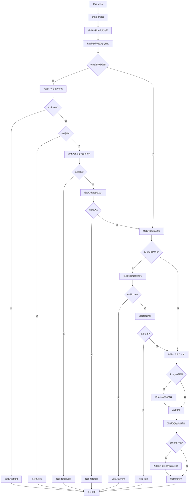

好的，我需要为提供的 Zig 函数 `zirShl` 绘制一个流程图。首先，我需要理解这个函数的结构和逻辑。

函数的主要任务是处理位移操作（如左移），并进行各种检查，如类型检查、运行时检查、安全性检查等。流程可能包括以下几个步骤：

1. **初始化和准备**：获取跟踪信息，解析指令数据，解析左右操作数，获取它们的类型和源代码位置。
2. **检查操作数是否可向量化**：确保左右操作数适合向量操作。
3. **处理右操作数为编译时常量整数的情况**：
   - 如果右操作数是未定义值，返回未定义引用。
   - 如果右操作数为0，直接返回左操作数。
   - 检查位移量是否超过左操作数类型的位数，如果是，报错。
   - 检查位移量是否为负数，如果是，报错。
4. **处理左操作数为编译时常量值的情况**：
   - 如果左操作数是未定义值，返回未定义引用。
   - 根据不同的位移类型（如精确位移、饱和位移），计算位移结果，处理溢出情况。
5. **处理饱和位移的特殊情况**：限制右操作数的类型，确保其不大于左操作数的位数。
6. **运行时检查和安全性检查**：
   - 确保在需要运行时块时进行相应的处理。
   - 检查位移量是否有效，添加必要的安全检查指令。
7. **生成并返回最终的位移指令**：根据不同的位移类型，生成对应的中间表示（AIR）指令。

需要注意的条件分支和循环：
- 当右操作数是向量类型时，需要遍历每个元素进行检查。
- 不同类型的位移（如 `.shl_exact`、`.shl_sat`、普通位移）有不同的处理逻辑。
- 安全性检查（如位移量是否过大、是否溢出）仅在启用安全检查时执行。

可能的错误处理：
- 使用 `sema.fail` 返回编译错误，需要在流程图中体现这些错误出口。

接下来，我需要将这些步骤转化为 Mermaid 的流程图语法，确保逻辑顺序正确，条件分支清晰，循环结构合理。
================================================
