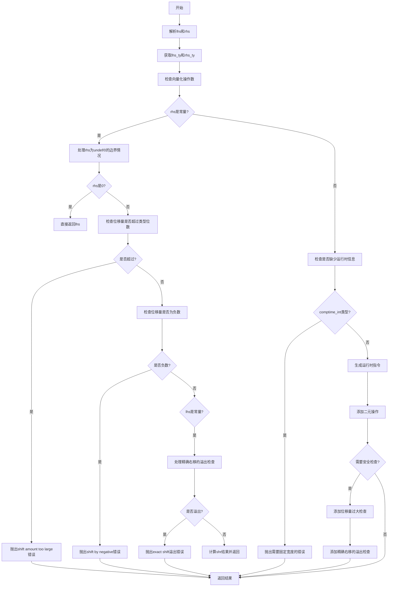

好的，我需要为给定的Zig函数`zirShr`绘制一个流程图。首先，我需要理解这个函数的功能和结构。这个函数似乎是处理位移操作的，特别是右移（shr）和精确右移（shr_exact）。函数内部有很多条件判断和错误处理，比如检查位移量是否过大、是否为负数，以及处理向量类型等。

首先，我会通读代码，识别主要的步骤和分支。函数开始于解析左右操作数（lhs和rhs），然后检查它们的类型。接着处理各种错误情况，比如位移量为负数或超过类型位数。之后，根据操作类型（shr或shr_exact）进行不同的处理，包括运行时检查和安全性验证。

接下来，我需要将这些步骤转化为流程图中的各个节点。可能的节点包括：开始、解析操作数、类型检查、错误处理（位移量过大、负数）、处理精确右移的溢出检查、生成结果等。每个条件判断会对应分支节点，如检查位移量是否为0、是否为向量类型等。

需要注意的是，代码中有多个嵌套的条件判断和循环（例如处理向量元素的循环），在流程图中可能需要用子流程或者循环结构来表示。不过，为了简化，可能将这些循环视为单一的条件检查节点。

另外，函数末尾的运行时安全检查和生成结果部分也需要在流程图中体现出来，包括添加二元操作、安全性验证等步骤。

最后，确保流程图的逻辑顺序正确，从函数入口开始，按照代码的执行顺序逐步展开，直到返回结果或抛出错误。每个可能的错误路径都应该有对应的终止节点。

可能遇到的挑战是如何简洁地表示复杂的条件分支和循环，同时保持流程图的可读性。需要平衡细节的展示和整体的清晰度，避免过于复杂而难以理解。
================================================

流程图说明：
1. 从解析操作数开始，检查类型和向量化支持
2. 对右侧操作数(rhs)进行边界条件处理（undef/0值）
3. 执行位移量合法性检查（是否超过位数、是否为负数）
4. 处理精确右移的特殊验证逻辑
5. 生成最终指令时添加运行时安全检查
6. 所有错误路径最终都会终止流程
7. 正常路径最终返回计算结果或生成的AIR指令

每个菱形节点表示条件判断，矩形节点表示操作步骤，椭圆形节点表示流程终止点。