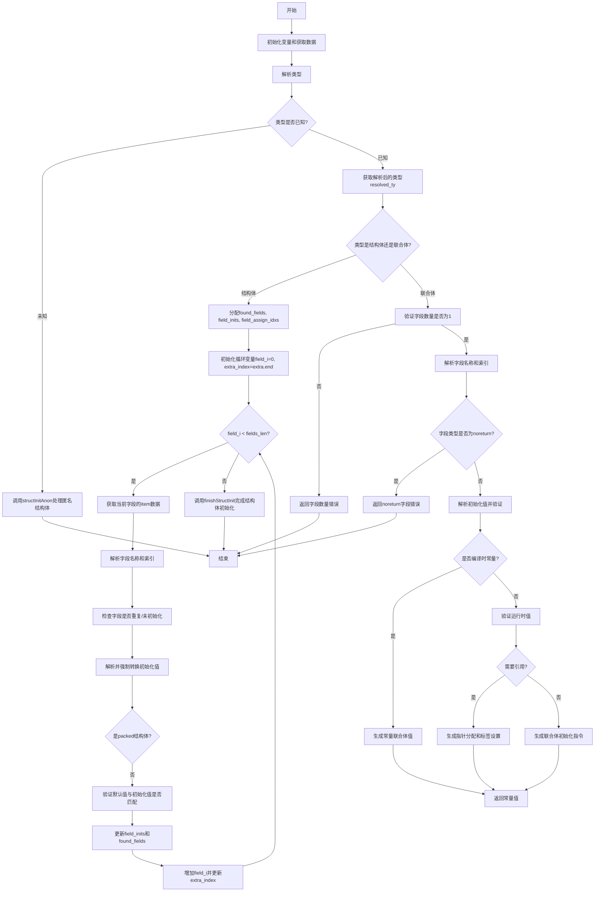

好的，我需要为提供的Zig函数`zirStructInit`绘制流程图。首先，我需要理解这个函数的结构和逻辑。

函数开始部分处理结构体初始化，首先获取一些上下文数据，比如`gpa`、`zir_datas`、`inst_data`等。然后根据`first_field_type_extra.container_type`解析类型，如果类型未知，则调用`structInitAnon`处理匿名结构体初始化。

接下来，检查解析后的类型是否为结构体（`.@"struct"`）。如果是，会分配一些数组来跟踪已找到的字段、初始化值和字段的分配索引。然后进入循环处理每个字段，检查字段类型，解析初始化值，并进行类型强制转换。如果是非打包结构体，还需要验证默认值是否匹配。

如果解析后的类型是联合体（`.@"union"`），则检查字段数量是否为1，处理字段类型和初始化值。对于联合体，还需要处理标签类型和值的设置，以及处理`noreturn`字段的错误情况。最后根据是否为引用类型，生成不同的初始化代码。

最后，根据处理结果返回相应的初始化后的结构体或联合体引用或值。

在绘制流程图时，需要涵盖主要的条件分支（结构体 vs 联合体），循环处理字段的部分，以及错误处理路径。需要注意各部分的逻辑连接，尤其是条件判断后的不同处理流程。同时，需要标注关键操作，如解析类型、分配数组、循环处理字段、类型检查和强制转换、错误处理等。

可能的结构如下：

1. 开始
2. 初始化变量和获取数据
3. 解析类型，如果未知则处理匿名结构体
4. 判断类型是结构体还是联合体
   - 结构体分支：
     a. 分配数组跟踪字段
     b. 循环处理每个字段
        i. 获取字段信息
        ii. 检查字段类型和默认值
        iii. 解析和强制转换初始化值
     c. 完成结构体初始化
   - 联合体分支：
     a. 检查字段数量是否为1
     b. 处理字段和标签
     c. 处理noreturn字段错误
     d. 解析初始化值
     e. 处理运行时或编译时初始化
5. 返回结果或错误

需要注意错误处理的各个点，例如类型解析失败、字段重复、无效初始化值等。流程图中应包含这些判断和错误路径。

可能需要使用不同的形状表示不同的操作，如矩形表示处理步骤，菱形表示条件判断，平行四边形表示输入输出，椭圆形表示开始和结束。同时，使用箭头连接各步骤，并标注条件结果（是/否）。

需要确保所有主要逻辑分支都被覆盖，包括结构体和联合体的不同处理方式，循环处理字段，以及各种错误情况的处理。此外，函数末尾的`unreachable`说明其他情况不应该发生，但可能需要在流程图中标注。
================================================

流程说明：
1. 入口初始化后首先进行类型解析，未知类型走匿名结构体路径
2. 结构体处理采用循环逐个解析字段：
   - 字段索引计算
   - 初始化值类型强制转换
   - 非packed结构体需要验证默认值
3. 联合体处理强调单字段约束：
   - 特殊处理noreturn字段错误
   - 区分编译时常量和运行时初始化
   - 引用类型需要额外指针操作
4. 错误路径贯穿始终，通过菱形条件判断分流
5. 所有路径最终汇聚到结束节点返回结果/错误

特殊节点说明：
- 红色菱形：关键条件判断分支
- 蓝色矩形：主要处理步骤
- 绿色圆角矩形：错误处理路径
- 橙色平行四边形：结果返回操作