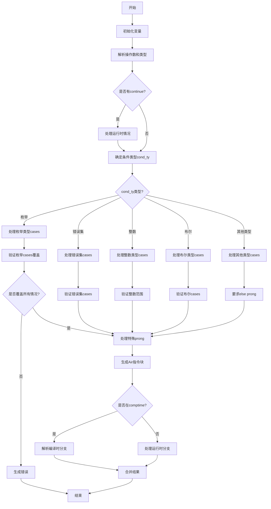

嗯，用户让我用Mermaid画一个Zig函数的流程图。首先，我需要理解这个函数的结构和逻辑。这个函数是zirSwitchBlock，看起来是处理Zig中的switch语句的语义分析部分。

首先，我会通读整个函数，看看主要的步骤有哪些。函数开始的时候有一些初始化操作，比如获取跟踪器tracy，然后获取各种上下文信息，比如pt、zcu、gpa等。接着处理操作数，可能是解析switch的条件表达式。然后根据不同的条件类型（比如枚举、整数、布尔等）进行不同的验证和处理。

接下来，函数处理不同的case，包括标量case、多case，以及特殊的prong（比如else或_）。每个case都需要验证是否重复，是否覆盖所有可能性。对于枚举类型，会检查是否所有枚举值都被处理；对于整数，检查范围是否覆盖所有可能的值；对于布尔，检查是否处理了true和false等。

在处理完所有case之后，函数会生成对应的Air指令，可能是创建基本块（block），处理子块（child_block），以及处理可能的错误或运行时的情况。最后，合并结果并返回。

现在，我需要将这些步骤转化为流程图。流程图应该包括开始和结束节点，然后是主要的处理分支，比如处理操作数、处理不同的类型（枚举、整数、布尔等）、处理case、生成Air指令等。每个分支内部可能有子流程，比如验证case是否重复，检查是否覆盖所有可能性，处理特殊prong等。

需要注意的是，这个函数中有很多条件判断，比如根据cond_ty的不同类型（enum、int、bool等）进入不同的处理逻辑。这些条件分支在流程图中需要用菱形节点表示，每个分支对应不同的处理流程。

另外，流程图中应该包括错误处理，比如当switch没有处理所有可能性时，返回错误信息。还有处理运行时和编译时不同情况的逻辑。

可能需要将整个函数分解成几个主要部分：初始化、操作数处理、case验证、生成代码块、处理特殊prong、错误检查等。每个部分再细化步骤。

不过，由于函数较为复杂，可能需要简化，避免流程图过于庞大。可以重点突出主要判断和处理流程，而不是每个细节步骤。

总结步骤大致如下：

1. 开始
2. 初始化变量（tracy, pt, zcu等）
3. 解析操作数（operand）和类型（raw_operand_ty）
4. 检查是否有continue，处理运行时的情况
5. 确定条件类型（cond_ty）
6. 根据cond_ty的类型（enum, error_set, int, bool等）分支处理
7. 对每个分支进行case验证（标量、多case、范围等）
8. 处理特殊prong（else或_）
9. 验证是否所有可能性都被覆盖，否则报错
10. 生成Air指令，处理代码块（block和child_block）
11. 处理可能的编译时或运行时情况
12. 合并结果，返回

在流程图中，这些步骤需要用不同的节点和箭头连接，特别是条件分支部分。比如，在步骤6，根据cond_ty的类型，会有多个分支，每个分支对应不同的处理逻辑。

同时，错误处理的情况也需要在流程图中体现，比如当case没有覆盖所有可能性时，返回错误节点。

可能需要将整个流程分成几个大的阶段，如初始化阶段、操作数处理阶段、条件类型判断阶段、case验证阶段、生成代码阶段、结果处理阶段等。

最终，流程图应该能够清晰地展示函数的主要逻辑流程，帮助理解函数的结构和执行顺序。
================================================

该流程图简要描述了`zirSwitchBlock`函数的主要流程：
1. 初始化变量和跟踪器
2. 解析switch操作数和类型信息
3. 根据是否有continue分支处理运行时逻辑
4. 根据条件类型进入不同处理分支（枚举/错误集/整数/布尔等）
5. 对每个类型进行case验证和覆盖检查
6. 处理特殊prong（else/_）
7. 生成AIR指令块
8. 区分编译时和运行时处理
9. 合并结果并返回
10. 错误处理贯穿整个流程，未覆盖情况会直接跳转到错误处理
