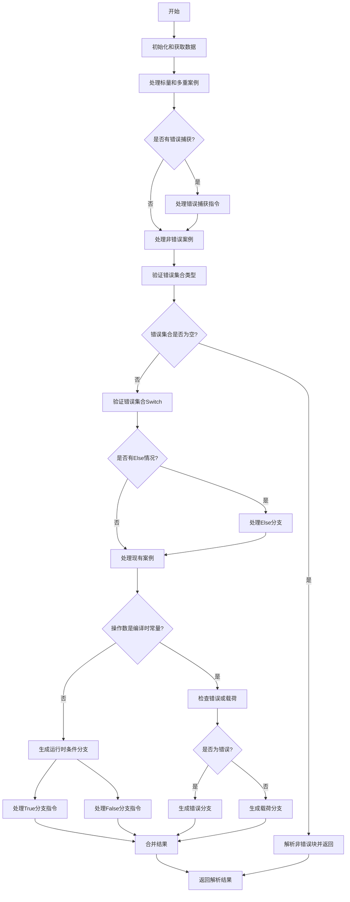

嗯，我需要帮用户画出这个Zig函数的流程图。首先，我得仔细读一下这个函数的代码，理解它的逻辑流程。这个函数名为zirSwitchBlockErrUnion，看起来是处理错误联合类型的switch块。

首先，函数开始时会进行一些初始化，比如获取跟踪信息、解析指令数据等。然后，它会处理各种情况，比如标量案例（scalar_cases）和多重案例（multi_cases），还有错误捕获的情况。接着，函数会验证错误集合，处理可能的错误情况，并根据条件生成不同的分支。

接下来，我需要将这个过程分解成步骤。函数的主要流程可能包括以下几个部分：
1. 初始化和获取必要的数据。
2. 处理switch块的不同情况（标量、多重、else情况）。
3. 验证错误集合，确保操作数的类型正确。
4. 根据操作数的值是否是编译时常量，决定如何处理分支。
5. 生成条件分支指令，处理正常情况和错误情况。
6. 最终合并结果并返回。

需要注意的条件和分支包括：
- 是否有错误捕获（any_uses_err_capture）。
- 是否有else分支（has_else）。
- 操作数是否为引用类型（payload_is_ref）。
- 错误集合是否为空。

可能的分支点包括：
- 当操作数的错误集合为空时，直接处理非错误情况。
- 如果操作数的值是编译时常量，提前决定执行哪个分支。
- 运行时检查操作数是否为非错误，生成条件分支。

在绘制流程图时，应该用不同的形状表示开始/结束、处理步骤、条件判断等。比如，矩形表示处理步骤，菱形表示条件判断，箭头表示流程方向。

需要确认各个条件判断后的流程走向，例如：
- 操作数类型是否正确？
- 错误集合是否为空？
- 是否有标量或多案例？
- 是否有else情况？
- 是否是编译时常量？
- 错误捕获是否存在？

可能还需要处理子块（sub_block）的生成和指令的添加，以及最终合并结果。

在画图时，确保每个判断点都有两个或多个出口，对应不同的处理路径。例如，如果错误集合为空，则进入非错误分支；否则继续处理可能的错误情况。同样，如果是编译时常量，直接解析值，否则生成运行时条件分支。

最后，确保流程图的连贯性，覆盖所有可能的执行路径，避免遗漏任何条件或步骤。
================================================

流程图说明：
1. 从初始化开始，获取必要的指令数据
2. 处理不同类型的案例（标量/多重）
3. 根据错误捕获标志处理错误捕获逻辑
4. 验证错误集合类型，如果为空则直接处理正常流程
5. 对非空错误集合进行switch验证，处理else分支
6. 根据操作数是否为编译时常量进行分支：
   - 常量值时直接解析错误/载荷分支
   - 运行时值生成条件分支指令
7. 合并所有执行路径的结果
8. 最终返回解析后的块结果

主要条件判断用菱形表示，处理步骤用矩形表示，最终合并点用圆形表示。流程覆盖了编译时和运行时两种情况处理，以及错误捕获、else分支等关键逻辑。