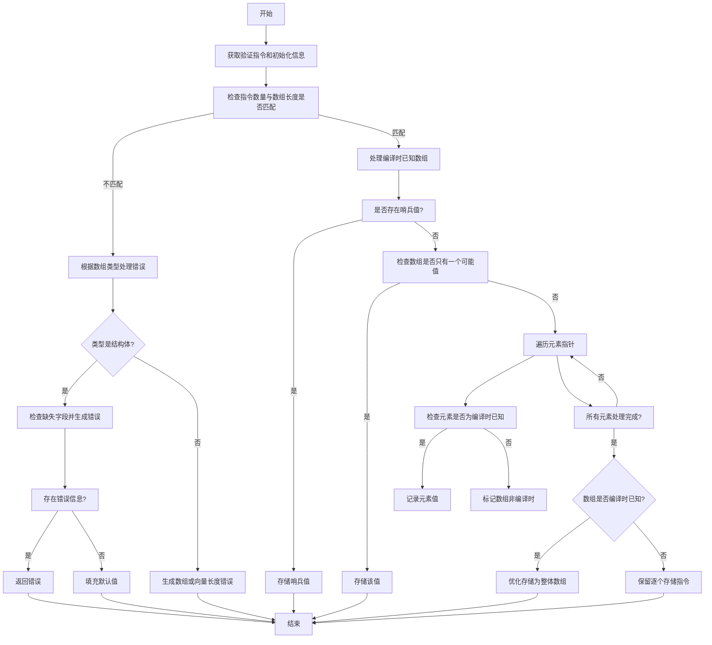

好的，我需要为给定的Zig函数`zirValidatePtrArrayInit`绘制流程图。首先，我需要理解这个函数的主要逻辑和各个步骤。这个函数看起来是用于验证指针数组的初始化，处理不同类型的数组（如结构体、数组、向量等），并在编译时进行一些检查和优化。

首先，我会通读代码，识别主要的条件判断和循环结构。例如，函数开始时获取一些基本信息和验证指令，然后检查数组的长度与指令的数量是否匹配。如果不匹配，根据数组类型（结构体、数组、向量）生成不同的错误信息。

接下来，处理编译时已知的情况，特别是处理哨兵值（sentinel）的情况。然后，检查数组是否只有一个可能的值，如果是，则直接存储该值。

之后，遍历所有元素指针，检查每个元素的存储指令，判断是否为编译时已知。如果所有元素都是编译时已知，则优化存储为一个整体的数组存储，而不是逐个元素存储。

在这个过程中，需要处理不同的情况，如元组类型、结构体字段的默认值等，并且需要处理可能的错误情况，生成相应的错误信息。

基于以上分析，我需要将这些步骤转化为流程图中的各个节点，并连接起来，反映函数的执行流程。包括开始、结束、条件判断、循环、错误处理等部分。

需要注意的是，由于代码中存在多个条件分支（如switch语句、if条件），需要正确地在流程图中表示这些分支。同时，循环结构（如while循环和for循环）也需要在流程图中体现出来。

最后，确保流程图的逻辑与代码一致，覆盖所有主要路径，包括正常流程和错误处理流程。
================================================
