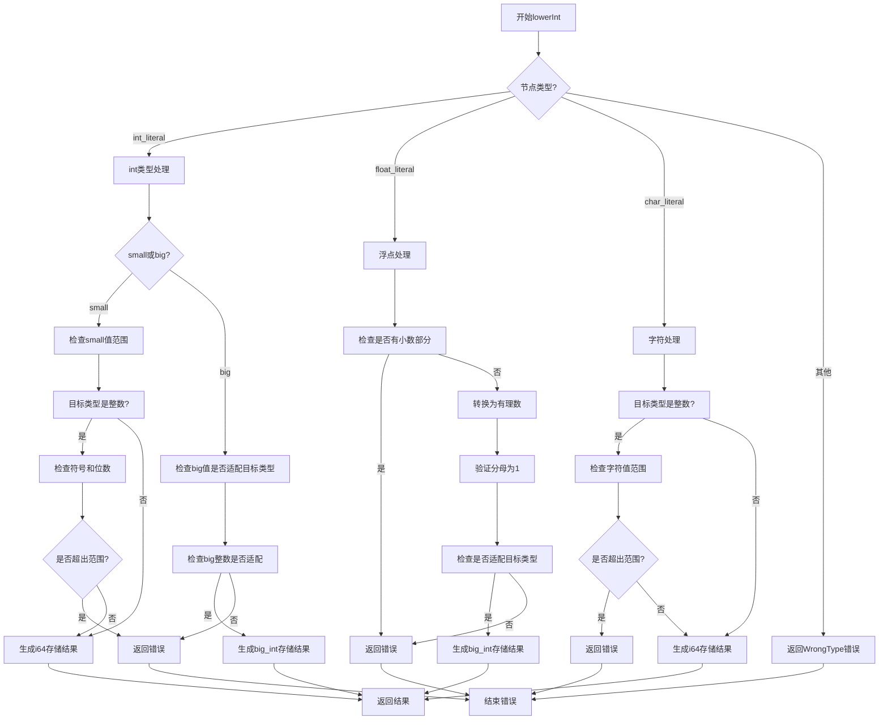

嗯，我需要帮用户用Mermaid画出这个Zig函数的流程图。首先，我得仔细看看这个函数的代码结构，理解每个部分的作用，然后转换成流程图的形式。

函数名是`lowerInt`，它处理不同类型的节点（比如整数、浮点数、字符字面量），并根据结果类型`res_ty`进行各种检查。如果检查不通过，就返回错误，否则生成对应的InternPool.Index。

首先，函数开始于一个switch语句，根据节点的类型分支处理。主要的case有三个：`.int_literal`、`.float_literal`和`.char_literal`，还有一个默认的`else`返回错误。

对于`.int_literal`，又分为`.small`和`.big`两种情况。`.small`处理较小的整数值，检查是否超出目标类型的范围，包括符号和位数。`.big`处理大整数，同样检查是否适合目标类型。

`.float_literal`需要检查是否有小数部分，如果有则报错。然后将浮点数转换为有理数形式，确保分母为1，接着检查是否适合目标整数类型。

`.char_literal`处理字符，检查字符值是否在目标整数类型的范围内，特别是无符号位的处理。

每个分支在检查失败时调用`self.fail`返回错误，成功则调用`self.sema.pt.intern`生成结果。

接下来，我需要将这些逻辑步骤转化为流程图的结构。每个case作为不同的分支，内部的判断和操作用条件框和过程框表示。注意处理错误路径和成功路径的分支。

可能的结构是：

1. 开始节点。
2. 判断节点类型，分为int、float、char和其他。
3. 对于int，再分small和big。
4. 每个子类型进行相应的条件检查，失败则到错误处理，成功则生成结果。
5. 对于float，检查小数部分，转换并验证。
6. 对于char，检查范围。
7. 所有成功路径最终生成结果，错误路径返回错误。

需要确保每个条件判断和操作步骤都清晰，流程图的箭头正确连接各个步骤。同时，注意处理不同情况下的错误情况，比如超出范围或无法转换的情况。

可能需要用不同的形状表示开始/结束、判断、过程、输入输出等。例如，菱形表示判断，矩形表示过程，平行四边形表示输入输出，椭圆形表示开始结束。

最后，将所有这些元素用Mermaid语法组织起来，确保结构正确，逻辑清晰。
================================================
