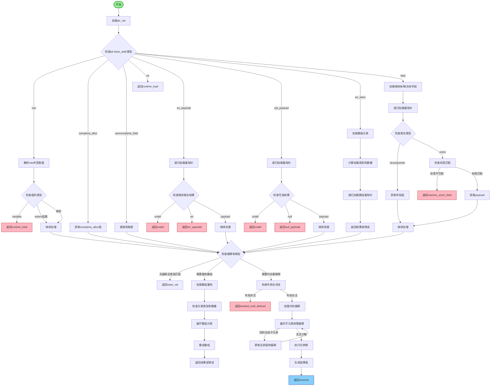

好的，我需要为这个Zig函数`loadComptimePtrInner`绘制一个流程图。首先，我要理解这个函数的结构和逻辑流程。

函数开始于处理`ptr_val`，根据不同的情况分支到不同的处理逻辑。例如，当`ptr.base_addr`是`nav`、`comptime_alloc`、`uav`等时，处理方式不同。接下来，根据不同的指针类型，如数组元素、结构体字段、联合体等，进行相应的加载操作。

然后，函数检查是否有字节偏移或位偏移，处理数组的重构，比如改变数组长度或重新结构化。之后，检查内存布局是否良好定义，如果不符合条件则返回错误。接着，处理当前值的偏移，可能需要深入到数组或结构体的子元素中。最后，通过位转换得到结果值。

在绘制流程图时，需要涵盖所有主要的分支和循环结构，例如`switch`语句中的不同情况、处理数组和结构体的循环遍历，以及错误处理路径。每个判断节点需要明确条件，如指针类型、偏移量是否为零、数组长度是否足够等。同时，需要标注各个步骤的结果，如返回`.undef`、`.runtime_load`、`.success`等。

需要注意的是，函数中有多个递归调用，例如在处理`eu_payload`和`opt_payload`时，会再次调用`loadComptimePtrInner`，这在流程图中需要用子流程或递归节点表示。此外，处理联合体和结构体时需要判断它们的布局类型，这也是重要的分支点。

最后，确保流程图的逻辑连贯，每个步骤之间的转换清晰，特别是错误处理路径和正常返回路径要区分明确。
================================================
