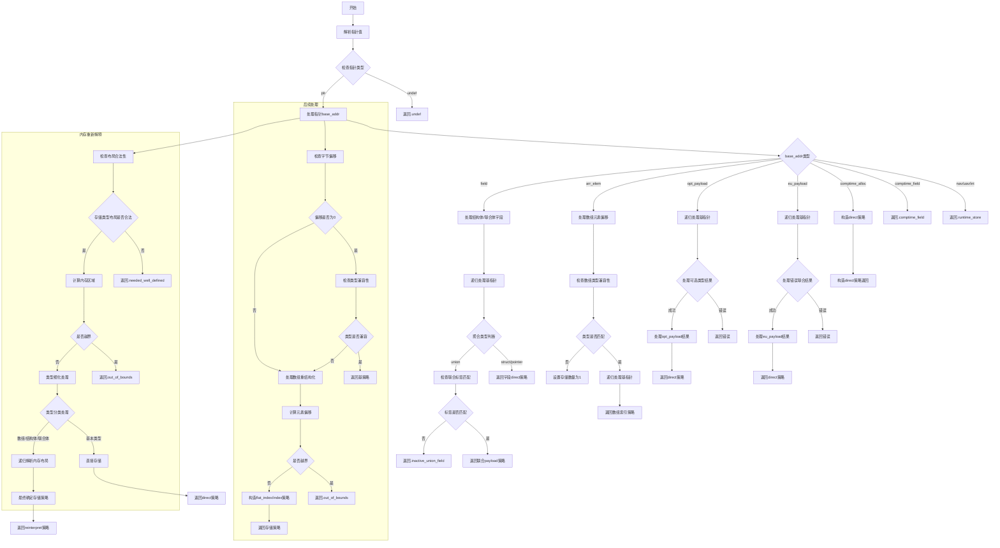

好的，我需要为这个Zig函数`prepareComptimePtrStore`画一个流程图。首先，我需要理解这个函数的结构和逻辑流程。看起来这个函数处理编译时指针存储的策略，根据不同的指针类型和存储类型来决定如何存储数据。

首先，函数开始部分处理指针的基本情况，比如检查指针是否是未定义（undef）、普通指针（ptr）等。然后根据指针的base_addr进行不同的处理，比如comptime_alloc、eu_payload、opt_payload、arr_elem、field等。每个分支可能有不同的逻辑，比如递归调用自身来处理更底层的指针结构。

接下来，函数处理数组偏移和类型转换的情况，检查是否需要重新结构化数组，或者是否超出了数组边界。这里可能涉及到计算元素偏移、检查类型兼容性等步骤。

然后，函数处理内存重新解释的情况，需要确保存储类型和目标类型都有良好定义的布局。如果布局不符合要求，会返回错误。此外，还会处理各种类型的结构体、联合体、数组等，尝试找到合适的存储策略。

最后，函数可能返回不同的存储策略，如direct、index、flat_index、reinterpret等，或者返回错误情况如undef、out_of_bounds等。

在绘制流程图时，我需要将这些主要步骤和分支逻辑可视化，包括条件判断、递归调用、错误处理等。可能需要使用不同的形状来表示不同的流程节点，如矩形表示处理步骤，菱形表示条件判断，平行四边形表示输入/输出等。

需要注意的是，代码中有多个switch语句和递归调用，这些需要在流程图中清晰地表现出来。同时，错误处理路径也需要明确标出。由于代码较为复杂，可能需要将流程图分为多个部分，逐步分解每个主要逻辑块。

可能遇到的挑战是如何简洁地表示递归调用和复杂的条件分支，以及确保所有可能的路径都被覆盖。需要仔细检查每个分支，确保没有遗漏重要的逻辑步骤。此外，代码中的注释和变量名可能有助于理解各个部分的功能，帮助正确构建流程图。
================================================
