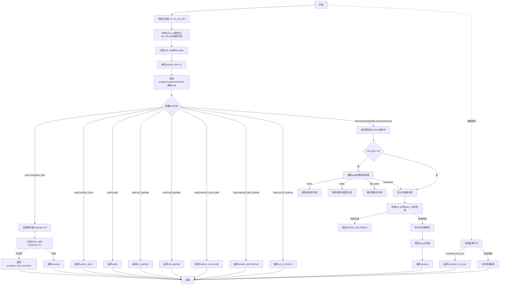

好的，我需要为给定的Zig函数`storeComptimePtr`绘制流程图。首先，我需要理解这个函数的结构和逻辑流程。让我先通读代码，理清各个步骤和条件分支。

函数开始时，获取`pt`和`zcu`，然后检查指针信息和存储值的类型是否匹配。接着处理位偏移和主机大小，确定伪存储类型。然后调用`prepareComptimePtrStore`获取策略`strat`。

接下来，根据不同的`strat`值进行分支处理。例如，如果是`.comptime_field`，则加载现有值并与存储值比较，若不匹配则返回错误。其他策略如`.direct`、`.index`等则处理不同的存储情况，比如直接存储、数组索引存储等。

之后，检查是否在运行时条件下，处理零主机大小的情况，根据策略进行不同的存储操作。如果存在位偏移或需要重新解释，则进行位转换操作，最后更新值并返回成功。

现在需要将这些步骤转化为流程图。流程图应包括开始、结束节点，各个条件判断（如switch语句），以及对应的处理步骤。需要注意循环结构（如`flattenArray`中的循环）和可能的递归调用（如`recursiveIndex`），但根据代码，这些可能已经在函数内部处理，因此可能不需要在流程图中详细展开。

需要注意处理错误返回和不同策略的分支。例如，当`strat`是`.comptime_field`时，需要加载现有值，检查是否匹配，否则返回错误。其他策略如`.runtime_store`直接返回相应结果。

可能的结构是：

1. 开始
2. 初始化变量（pt, zcu, ptr_info等）
3. 计算host_bits和bit_offset
4. 确定pseudo_store_ty
5. 调用prepareComptimePtrStore获取strat
6. 根据strat进行分支处理
   a. 如果是.comptime_field：加载现有值，比较，返回结果
   b. 其他情况如.direct, .index等处理存储
7. 检查是否在运行时条件中
8. 处理host_bits为0的情况
9. 处理位转换和存储
10. 返回结果

需要确保每个条件分支都有对应的流程路径，错误处理部分也要体现出来。例如，当`prepareComptimePtrStore`返回不同的strat时，每个case都要处理。

可能忽略一些细节，如具体的位计算，但需要保留主要逻辑判断和步骤。对于循环部分，如`flattenArray`和`for`循环，可以简化为一个处理步骤，不展开内部循环。

最后，确保流程图的连贯性和正确性，覆盖所有可能的返回路径。
================================================
