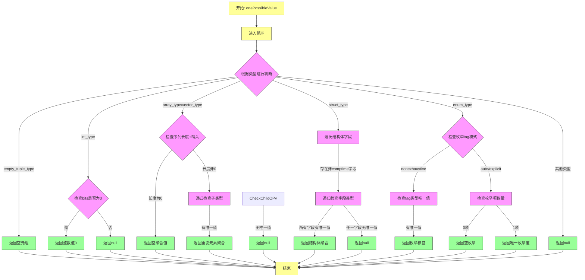

嗯，用户让我用Mermaid画出一个Zig函数的流程图。首先，我需要仔细阅读并理解这个函数的逻辑。这个函数叫做onePossibleValue，看起来是判断某个类型是否只有一个可能的值，并返回该值或者null。

首先，函数开始于pub fn onePossibleValue，接受starting_type和pt作为参数。然后进入一个无限循环，使用switch处理ty.toIntern()的结果。不同的类型有不同的处理逻辑，比如empty_tuple_type直接返回空元组，int_type根据位数判断，如果是0位就返回0，否则返回null。

接下来，我需要把每个分支转化为流程图中的节点和判断框。比如，遇到array_type或vector_type时，会检查长度和哨兵值，然后递归调用onePossibleValue检查子类型。对于struct_type，需要遍历所有字段，每个字段的类型都需要检查是否只有一个可能的值，如果全部满足才返回聚合值。

还有一些特殊情况，比如union_type需要检查标签和值的唯一性，enum_type根据不同的tag_mode处理不同的情况。每个条件分支都需要在流程图中表示出来，比如switch case中的各个类型处理。

需要注意的是，函数中有递归调用的情况，比如在处理数组或结构体时，会递归检查子类型。这可能需要在流程图中用子流程或者单独的处理节点来表示。

另外，一些类型直接返回null，比如ptr_type、error_union_type等，这些可以归为同一类处理。还有一些简单类型如void、noreturn等直接返回特定值。

在绘制流程图时，可能需要将主循环作为开始，然后根据不同的类型分支展开。每个分支处理完后，可能会有返回或继续循环的情况。需要确保所有可能的路径都被覆盖，包括错误处理和递归调用。

最后，要确保流程图的逻辑清晰，节点和箭头正确表示代码的执行流程。可能需要将复杂的逻辑拆分成多个子图，特别是处理结构体、联合体和枚举的部分，因为它们涉及多个步骤和条件判断。
================================================
