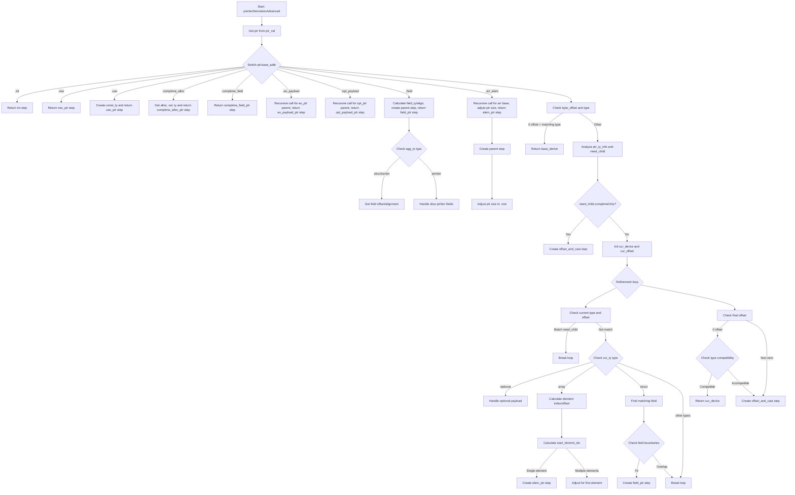

嗯，我需要为这个Zig函数`pointerDerivationAdvanced`画一个流程图。首先，我得理解这个函数的大致结构和逻辑。看起来这个函数处理指针的派生步骤，根据不同的指针类型进行不同的处理，比如处理结构体字段、数组元素、可选类型的有效载荷等。然后根据不同的条件进行递归处理，最后可能返回不同的派生步骤或者进行偏移和类型转换。

首先，我需要分解函数的各个部分。函数开始于获取指针的基础地址，然后根据不同的`base_addr`类型进入不同的分支。每个分支处理不同的情况，比如`.int`直接返回，`.nav`和`.uav`处理导航指针，`.comptime_alloc`处理编译时分配的内存，`.field`处理结构体或联合体的字段，`.arr_elem`处理数组元素，等等。之后，函数处理字节偏移和类型调整，可能需要递归地细化指针的派生步骤，直到满足某些条件，最后返回相应的结果。

接下来，我需要将这些逻辑步骤转化为流程图。流程图的开始应该是函数入口，然后根据不同的`ptr.base_addr`类型分支出不同的处理路径。每个分支处理完后可能会有递归调用或者进一步的判断。例如，处理`.field`时可能会递归调用`pointerDerivationAdvanced`来处理基础指针，然后调整类型和偏移。之后，函数检查偏移和类型是否需要进一步调整，可能需要进入循环来细化指针，比如处理数组或结构体的字段。最后，如果所有条件都满足，返回当前的派生步骤，否则进行偏移和类型转换。

需要注意的是，循环和条件判断的结构，特别是处理`while (true)`循环的部分，可能需要多次迭代细化指针。此外，递归调用需要正确表示父子步骤之间的关系。可能还需要处理错误或特殊情况，比如类型不匹配时的处理。

现在，我需要将这些逻辑步骤用Mermaid的流程图语法表示出来。每个判断节点用菱形，处理步骤用矩形，箭头表示流程方向。可能需要将递归调用表示为子流程，或者用注释说明。需要确保每个分支都正确连接，循环部分也正确表示。

在绘制过程中，可能会遇到复杂的条件判断，比如多个嵌套的switch和if语句，需要简化表示，避免流程图过于复杂。同时，需要保持逻辑的清晰，确保每个步骤的处理流程都能被正确追踪。

最后，检查流程图是否覆盖了所有主要分支和处理步骤，确保没有遗漏重要的逻辑路径。可能需要进行多次调整和优化，使流程图既准确又易于理解。
================================================

该流程图展示了：
1. 初始分支处理不同指针基地址类型
2. 结构体/联合体字段的复杂对齐计算
3. 数组元素的索引解析
4. 可选类型和错误联合的有效载荷处理
5. 多层指针细化循环
6. 最终类型兼容性检查和偏移处理
7. 递归调用关系的隐式表示（通过parent_step创建）
8. 编译时分配和特殊指针类型的单独处理路径

每个主要判断点用菱形表示，处理步骤用矩形表示，箭头方向展示逻辑流向。循环结构通过"Refinement loop"节点和回指箭头示意，实际实现时需注意循环条件会在每次迭代时重新评估。