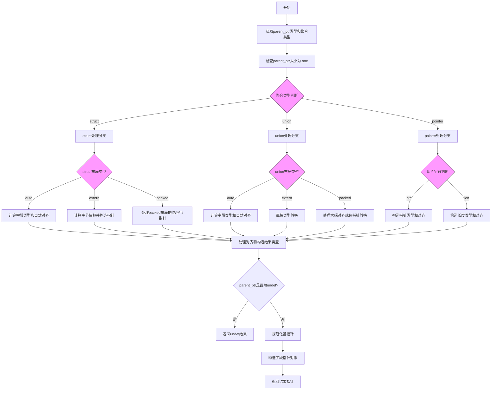

嗯，我需要画出这个Zig函数的流程图。首先，我得先理解这个函数是做什么的。看起来这个函数`ptrField`是用来获取一个结构体或联合体字段的指针。函数接收一个父指针、字段索引和一些线程相关的参数，然后返回对应字段的指针。

首先，函数开始部分获取父指针的类型和聚合类型（比如结构体或联合体）。然后检查父指针的类型信息，确保其大小为.one。接下来是一个大的switch语句，根据聚合类型的类型标签（struct、union、pointer等）处理不同的情况。

对于结构体（struct），需要考虑不同的布局（auto、extern、packed）。每种布局下计算字段的类型和对齐方式，然后生成相应的指针类型。如果是extern布局，直接计算偏移量并返回偏移后的指针。如果是packed布局，可能需要处理位指针或字节指针的情况。

联合体（union）的处理也类似，根据布局不同处理对齐和指针类型。对于指针类型，比如切片（slice），处理ptr和len字段的情况。

之后，处理对齐方式，确定新的对齐值，然后构造结果指针类型。最后，处理父指针可能是未定义的情况，并返回最终的指针值。

为了画流程图，我应该按照函数的执行顺序，把主要的分支和步骤列出来。可能需要从函数入口开始，然后按照条件分支（如switch case）展开各个情况，处理每个情况下的逻辑，最后合并到返回结果。

需要注意的是，流程图中要体现不同聚合类型（struct、union、pointer）的处理流程，以及不同布局（auto、extern、packed）下的不同逻辑。此外，对齐计算和指针类型的构建也是关键步骤。

可能的结构是：

1. 开始
2. 获取父指针类型和聚合类型
3. 检查父指针大小是否为.one
4. 根据聚合类型进入不同的处理分支
   a. struct分支
      i. auto布局：计算字段类型和对齐
      ii. extern布局：计算字节偏移，构造指针
      iii. packed布局：处理位或字节指针
   b. union分支
      i. 类似struct的分支处理
   c. pointer分支（处理slice的ptr和len）
5. 处理对齐和构造结果类型
6. 处理可能的undef情况
7. 构造并返回结果指针

每个分支可能需要不同的子流程，特别是struct和union的不同布局情况。需要确保每个条件分支都正确表示，并且最终合并到共同的返回步骤。

可能遇到的困难是处理复杂的条件嵌套和确保每个case都被正确映射到流程图中。需要仔细检查每个switch case和内部的条件判断，确保流程图覆盖所有可能的路径。
================================================

流程说明：
1. 入口检查指针类型和聚合类型
2. 通过类型标签分支到struct/union/pointer处理
3. 对struct和union进一步按布局类型细分处理逻辑
4. 切片类型单独处理ptr/len字段
5. 统一处理对齐方式并构建最终指针类型
6. 最后处理特殊情况（undef）和指针构造
7. 所有路径最终汇聚到结果返回节点

每个菱形节点表示类型判断分支，矩形节点表示具体操作步骤，不同颜色标注主要分支判断点。