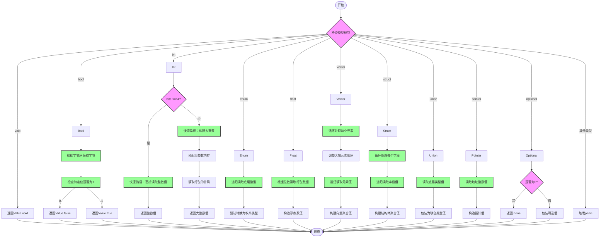

嗯，用户让我用Mermaid画出这个Zig函数的流程图。首先，我需要仔细阅读代码，理解每个分支和处理逻辑。这个函数`readFromPackedMemory`看起来是根据不同的类型标签（TypeTag）来处理从打包内存中读取值的情况。

首先，函数开始会检查类型标签。例如，如果是`.void`就直接返回`Value.void`，如果是`.bool`则读取特定的位并返回true或false。接下来是处理整数类型，分为快速路径（<=64位）和慢速路径（大整数）。然后是枚举、浮点数、向量、结构体、联合体、指针和可选类型等。

接下来，我需要确定如何将每个分支转化为流程图的节点和判断条件。每个`switch`的分支对应不同的处理流程，可能需要用条件判断框来表示。例如，处理`int`类型时，有一个条件判断bits是否小于等于64，这可能需要一个决策节点。

需要注意的是，有些分支内部还有循环，比如处理向量和结构体时的循环遍历元素或字段。这些循环需要在流程图中用循环结构表示。此外，错误处理（如返回错误）也需要在流程图中体现出来。

还有，函数中有递归调用，比如在处理`enum`类型时调用`readFromPackedMemory`自身，这可能需要用子流程或者单独的节点表示递归步骤。

另外，对于不同的endian处理（大端和小端），在流程图中需要不同的路径。例如，在读取布尔值时，根据endian选择不同的字节位置。

可能还需要考虑一些异常情况，比如未实现的类型标签会触发panic，这也需要在流程图中标明。

总结一下，流程图的步骤大致如下：
1. 开始函数。
2. 根据类型标签分派到不同处理分支。
3. 每个分支处理对应的逻辑，可能包含子判断（如整数位数）、循环（向量、结构体字段）、递归调用（如枚举）。
4. 处理完成后返回相应的Value或错误。
5. 结束。

在绘制时，需要确保每个分支清晰，条件判断明确，循环和递归正确表示。同时，保持流程图的简洁性和可读性，避免过于复杂。可能需要将某些复杂部分拆分为子流程，比如处理大整数的慢速路径单独作为一个子流程块。
================================================
