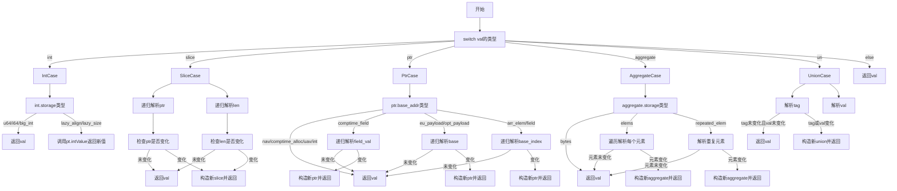

嗯，我需要为这个Zig函数`resolveLazy`画一个流程图。首先，我得理解这个函数的结构和逻辑。看起来这个函数处理不同类型的值，递归地解析它们的“懒惰”部分，比如指针、切片、聚合类型等。

首先，函数开始于一个`switch`语句，根据`val`的类型进入不同的处理分支。每个分支有不同的处理逻辑，比如`int`、`slice`、`ptr`、`aggregate`等。对于每个类型，可能需要递归调用`resolveLazy`来解析子元素，比如切片的`ptr`和`len`，指针的`base_addr`，聚合类型的元素等。

我需要将这些分支结构转化为流程图。每个`switch`的分支对应一个决策节点，然后根据不同的类型进行不同的处理。比如，处理`int`时，如果存储类型是`u64`、`i64`或`big_int`，直接返回原值；如果是`lazy_align`或`lazy_size`，则调用`pt.intValue`。处理`slice`时，递归解析`ptr`和`len`，如果解析后的值和原值相同则返回原值，否则构造新的切片值。

对于`ptr`类型，根据`base_addr`的不同情况处理，比如`comptime_field`、`eu_payload`、`opt_payload`、`arr_elem`、`field`等，都需要递归解析基础值，然后根据是否变化来决定是否创建新的指针值。

聚合类型`aggregate`有不同存储方式，比如`bytes`、`elems`、`repeated_elem`，需要处理每个元素或重复元素，递归解析后决定是否返回新值。

联合类型`un`需要解析标签和值，如果有变化则创建新的联合值。

其他类型直接返回原值。

在画流程图时，需要将这些逻辑分支用条件判断节点表示，递归调用表示为子流程或子节点。同时注意处理内存分配和错误处理，比如`try`可能会返回错误，但流程图中可能简化错误处理，只关注主要流程。

可能的结构是从函数入口开始，根据不同的类型分支展开，每个分支内部处理各自的逻辑，递归调用自身处理子元素，最后决定返回原值还是新构造的值。需要注意循环或重复结构，比如处理聚合类型的元素数组时需要遍历每个元素，这在流程图中可以用循环节点表示。

现在，我需要将以上逻辑整理成Mermaid的流程图语法，正确表示各个分支和递归调用。
================================================
