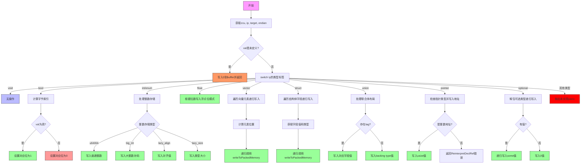

好的，我需要为提供的Zig函数`writeToPackedMemory`绘制流程图。首先，我需要仔细阅读代码，理解函数的结构和逻辑分支，然后将这些步骤转化为Mermaid的流程图语法。

首先，函数开始时会进行一些初始化操作，比如获取`zcu`、`ip`、`target`和`endian`。然后检查`val`是否是未定义值，如果是，处理未定义的情况，写入0并返回。接下来是一个大的switch语句，根据类型标签`ty.zigTypeTag(zcu)`来处理不同的数据类型。

每个case分支对应不同的类型处理，比如`.void`、`.bool`、`.int`、`.float`、`.vector`等。每个分支内部有特定的逻辑，比如`.bool`类型需要根据字节序计算字节索引，并设置相应的位。`.int`类型需要处理不同的整数存储方式，如大整数、延迟对齐等。`.vector`类型需要遍历每个元素，并递归调用`writeToPackedMemory`。结构体和联合体的处理涉及字段的迭代和递归调用。指针和可选类型也有各自的处理逻辑。

需要注意的是，每个分支可能会有错误处理，比如返回错误`ReinterpretDeclRef`或`OutOfMemory`，或者断言失败。此外，某些分支可能抛出未实现的panic，如最后的`@panic("TODO implement writeToPackedMemory for more types")`。

在绘制流程图时，需要将每个判断条件和处理步骤转化为相应的节点和分支。例如，首先检查`val.isUndef`，然后进入类型判断的switch，每个case分支对应不同的处理流程。对于递归调用的情况，如向量和结构体，需要在流程图中表示循环或迭代的过程。

可能需要将复杂的逻辑拆分成子流程，特别是对于结构体和联合体的处理，涉及多个字段的遍历。此外，错误处理路径也需要明确标出，比如返回错误或触发断言。

在转换为Mermaid语法时，使用矩形节点表示操作步骤，菱形节点表示条件判断，箭头表示流程走向。需要确保所有分支都被覆盖，包括异常情况和递归调用。

最后，检查流程图是否准确反映了函数的逻辑，确保没有遗漏重要的步骤或条件。
================================================
