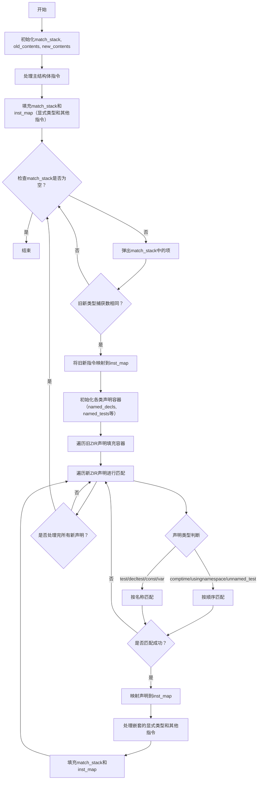

好的，我需要帮用户用Mermaid画出这个Zig函数的流程图。首先，我得仔细阅读代码，理解它的结构和工作流程。

这个函数`mapOldZirToNew`的主要功能是将旧的ZIR（Zig Intermediate Representation）映射到新的ZIR，使用一个指令映射表`inst_map`。看起来它处理了不同类型的声明和指令，比如结构体、联合体、测试等，并根据名称或顺序进行匹配。

首先，函数初始化了一些数据结构，比如`match_stack`用来保存匹配的声明，`old_contents`和`new_contents`用于临时存储内容。然后，它处理主结构体指令，将显式类型和其他指令按顺序映射。接着，通过循环处理`match_stack`中的每个匹配项，检查类型捕获的数量是否一致，然后处理命名和未命名的声明、测试等，将它们添加到对应的哈希映射或列表中。

在每一步中，函数会递归处理嵌套的声明，将找到的指令添加到`match_stack`中，继续循环处理，直到栈为空。

现在，我需要将这些步骤转化为流程图。流程图应该包括开始、初始化数据结构、处理主结构体、循环处理匹配项、处理不同类型的声明，以及结束。每个条件判断（如类型捕获数量是否一致）需要分支，循环结构也要正确表示。

需要注意的是，代码中有多个循环和条件判断，比如`while (match_stack.pop())`循环，内部处理各种声明类型的逻辑。同时，对于不同种类的声明（如comptime、usingnamespace、test等），有不同的处理方式，需要分支表示。

可能的结构是：
1. 开始
2. 初始化match_stack, old_contents, new_contents
3. 处理主结构体指令，填充match_stack和inst_map
4. 进入循环，弹出match_stack中的项
5. 检查类型捕获数量是否一致，不一致则跳过
6. 映射当前指令到inst_map
7. 处理各种声明类型，填充对应的哈希表和列表
8. 遍历新声明，匹配旧声明，处理每个类型
9. 处理嵌套的显式类型和其他指令，填充match_stack和inst_map
10. 循环直到match_stack为空
11. 结束

需要确保每个步骤和条件正确对应代码中的逻辑，并用合适的Mermaid元素表示，如流程节点、条件判断、循环等。

可能遇到的挑战是如何简化复杂的循环和嵌套结构，使其在流程图中清晰易读。比如，处理不同类型的声明部分可能有多个分支，需要合理组织，避免图表过于复杂。
================================================

流程说明：
1. 初始化阶段创建匹配栈和临时缓冲区
2. 处理主结构体指令，按顺序匹配显式类型和其他指令
3. 进入主循环处理所有匹配项：
   - 检查类型捕获数一致性
   - 构建声明映射表（按名称或顺序）
   - 递归处理嵌套声明
4. 使用菱形节点表示条件判断
5. 绿色路径表示声明匹配流程
6. 黄色路径表示循环控制流
7. 蓝色路径表示递归处理流程