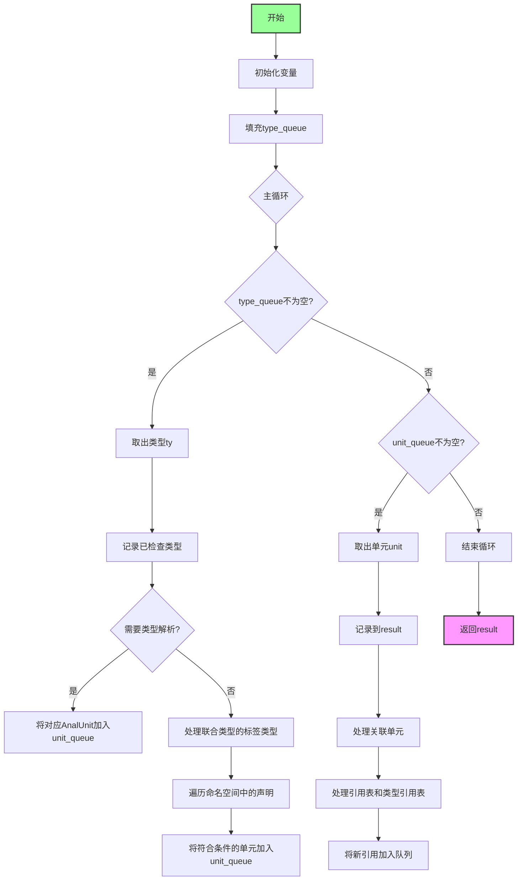

嗯，我现在需要为这个Zig函数画一个流程图。首先，我得仔细看看这个函数是做什么的。函数名是resolveReferencesInner，看起来是用来解析引用的，可能涉及类型和单元的引用关系。

首先，函数开始声明了一些变量，比如result、checked_types、type_queue、unit_queue。然后处理zcu.analysis_roots，把每个模块的路径解析后获取对应的文件，并获取根类型root_ty，如果存在的话就加入type_queue。

接下来进入一个循环，处理type_queue和unit_queue。在type_queue的处理中，对于每个类型ty，检查是否需要类型解析，如果需要，就将对应的AnalUnit加入unit_queue。如果是联合类型且有生成的标签类型，也会处理标签类型。然后遍历命名空间的comptime_decls、test_decls、pub_decls、priv_decls等，将符合条件的单元加入unit_queue。

然后是处理unit_queue的部分，对于每个单元，将其加入result，并处理与之关联的其他单元。同时，处理引用表type_reference_table和all_type_references，将未检查的类型加入type_queue。

整个过程交替处理type_queue和unit_queue，直到两个队列都为空，最后返回result。

画流程图的时候，我需要把整个流程分成几个主要部分：初始化变量、处理analysis_roots填充type_queue、主循环处理type_queue和unit_queue、处理每个类型和单元的引用关系，最后返回结果。

可能需要注意条件判断和循环结构，比如while循环中的两个队列处理，以及各种条件分支，比如has_resolution的判断，不同类型的处理逻辑，还有队列的放入和取出顺序。

需要确保每个步骤都正确对应到流程图的节点和判断框，特别是循环和条件分支的位置。可能需要使用不同的形状，如矩形表示操作，菱形表示判断，箭头表示流程方向。

可能还需要注意错误处理部分，比如errdefer的释放操作，但在流程图中可能不需要详细展示，除非影响主流程。

总之，我需要将代码结构分解为主要的流程步骤，然后按照逻辑顺序用mermaid语法画出各个节点和连接线，确保循环和条件分支正确表示。
================================================
