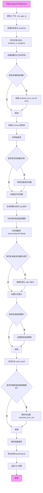

嗯，我需要帮用户用Mermaid画出这个Zig函数的流程图。首先，我得仔细阅读并理解这个函数的代码结构。这个函数名为analyzeFnBodyInner，看起来是用于分析函数体的内部逻辑，生成对应的Air中间表示。函数内部有很多步骤，比如初始化各种结构、处理参数、进行语义分析（Sema）、处理错误跟踪等。

首先，我应该理清函数的主要步骤。函数开始时会获取一些上下文信息，比如zcu、gpa、ip等。然后进行一些设置，比如将当前分析单元放入analysis_in_progress中，错误处理部分使用errdefer。接着处理函数的泛型所有者，初始化Sema结构体，处理参数，包括运行时参数和编译时参数。然后分析函数体，处理可能的错误返回跟踪，最后生成Air的指令和额外信息。

接下来，我需要将这些步骤转化为流程图。流程图通常包括开始、各个处理步骤、判断分支、结束等。由于这个函数较长且复杂，可能需要分块处理，比如初始化阶段、参数处理阶段、语义分析阶段、错误处理阶段、结果生成阶段等。

需要注意的是，函数中有一些条件判断，比如处理comptime_args的情况，检查是否有inferred_error_set，处理error tracing的设置等。这些条件分支应该在流程图中体现出来。另外，循环结构比如遍历参数和comptime_args的部分也需要用循环节点表示。

另外，错误处理部分，比如errdefer和try语句，可能需要单独的分支来处理错误情况。但根据函数结构，大部分错误可能直接返回，所以可能在流程图中表现为可能的错误出口。

最后，生成Air的步骤，包括填充air_instructions和air_extra，以及处理主块（main_block）的部分，也需要在流程图中体现。

可能需要将整个流程分解为几个主要部分：

1. 初始化阶段：获取上下文，设置分析单元，初始化Sema。
2. 参数处理：处理comptime参数和运行时参数，生成对应的Air指令。
3. 函数体分析：调用sema.analyzeFnBody处理函数体。
4. 错误跟踪设置：处理错误返回跟踪。
5. 后处理：解析推断错误集，设置函数状态，生成最终的Air结果。

每个部分内部可能还有子步骤和条件判断。比如参数处理部分需要判断是否是泛型实例，是否有comptime_args等。函数体分析后可能需要处理未解决的inferred_allocs，设置分支提示，处理错误跟踪等。

在绘制流程图时，需要将这些步骤按顺序排列，并用条件判断节点连接不同的分支。例如，处理comptime_args时会遍历每个参数，如果参数是none则跳过，否则处理。这部分可能需要一个循环结构。

另外，流程图中需要注意函数中的异常处理，比如使用try和catch的地方，但在这个函数中，大部分错误会通过返回错误码处理，可能不需要在流程图中详细画出每个可能的错误路径，除非用户特别要求。

总结来说，我需要将这个函数分解成几个主要步骤，用Mermaid的流程图语法表示这些步骤的顺序和条件分支，确保逻辑清晰，结构合理。
================================================

该流程图描述了函数的主要执行步骤：
1. 初始化阶段获取上下文并创建分析单元
2. 处理函数分析状态和错误集
3. 构建语义分析器(Sema)并处理参数（包含泛型实例的特殊处理）
4. 核心函数体分析和错误跟踪处理
5. 后处理阶段包括未解决分配的清理、分支提示设置
6. 最终生成AIR中间表示并返回结果
关键分支用菱形节点表示，包括泛型判断、错误集处理、错误跟踪启用等逻辑