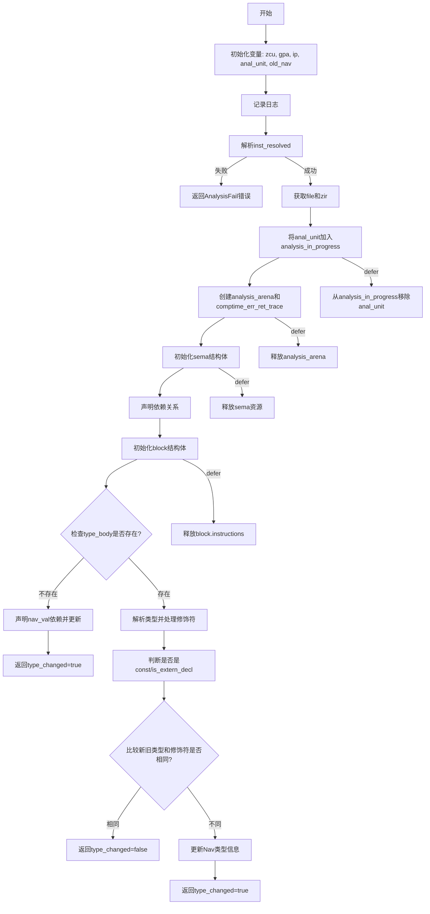

嗯，我需要画这个函数的流程图。首先，我得仔细读一下这个函数的代码，理解它的逻辑结构。这个函数叫analyzeNavType，看起来是用于分析导航类型的。函数参数有pt和nav_id，返回一个结构体，里面有个type_changed的布尔值。

开头部分，函数从pt中获取zcu，然后从zcu中获取gpa和ip。接着定义了一个anal_unit，类型是.wrap(.{ .nav_ty = nav_id })，然后获取旧的nav信息，记录日志。

接下来，函数尝试解析inst_resolved，如果失败就返回AnalysisFail错误。然后获取对应的文件和zir数据。之后，把anal_unit放入analysis_in_progress中，并用defer确保之后会移除。创建了analysis_arena和comptime_err_ret_trace，用于内存管理和错误跟踪。

然后初始化sema结构体，设置各种参数，包括pt、gpa、arena等。之后声明依赖关系，特别是依赖于旧的zir_index。接着定义了一个block结构体，设置其父块、sema、命名空间等信息。

接下来检查zir_decl的类型，如果是usingnamespace的话，处理相关逻辑。然后处理类型体，如果type_body不存在，则依赖nav_val，并调用ensureNavValUpToDate，最后返回type_changed为true。

如果type_body存在，则解析类型，处理指针修饰符，比如对齐方式、链接段、地址空间等。然后根据zir_decl的类型判断是否是常量，是否是外部声明。

接下来比较新旧类型和修饰符是否改变。如果没变，返回type_changed为false；如果变了，调用resolveNavType更新信息，并返回true。

我需要把这些步骤拆解成流程图的各个节点和判断分支。可能的判断点包括：type_body是否存在，新旧类型是否相同，是否有错误发生等。同时需要注意处理依赖关系和内存管理的部分，比如defer语句的作用。

可能的结构是：开始 -> 初始化变量 -> 解析inst_resolved -> 检查是否有type_body -> 如果没有，处理nav_val -> 返回true；如果有，解析类型 -> 处理修饰符 -> 比较新旧 -> 如果不同，更新并返回true，否则返回false。

需要注意错误处理和资源释放的部分，比如defer analysis_arena.deinit()和sema.deinit()，这些可能需要在流程图中体现为清理步骤。不过流程图主要关注控制流，资源管理可能可以简化。

另外，函数中有多个返回点，需要明确每个返回的条件。例如，当type_body不存在时直接返回true；当新旧类型相同返回false，不同返回true。同时，错误处理部分如返回AnalysisFail也需要在流程图中表示。
================================================

流程说明：
1. 初始化阶段获取上下文信息并记录日志
2. 解析指令失败时直接返回错误
3. 对类型体存在性进行分支判断：
   - 无类型体时建立值依赖并强制更新
   - 有类型体时执行完整类型推导
4. 比较新旧类型元数据决定是否需要更新
5. 所有资源管理操作通过defer自动处理（图中以虚线框简化表示）